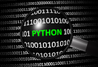

<p>
    
    <br>
    Andrew Janke<br>
    Michael Patterson<br>
</p>
<br>

   ____________________________________________

# Python Types

In the following sections of this document we'll browse through the
Python language syntax. We will include code snippets. If you've
installed Python on your computer, or if you've chosen an online
Python engine, you can try out the examples.

We'll start with data types, and later move into control structures.
Because we'll include code snippets below, you'll have a good feel for
the control structures before we arrive at that section. Later, we will
look at Python's object-oriented programming model. And lastly, we'll
look at select portions of the Python ecosystem.

## Numeric Types

MATLAB and Python have many similarities in their numeric types and
calculations upon those types. The core Python library defines fewer
types than MATLAB does, but add-on libraries will fill any voids you may
notice.

-   There are three distinct numeric types: int, float, and complex.

-   All of the usual calculations are supported, with the usual order
    of precedence.

-   The usual +, -, *, and / operations are supported.

-   There are other operations, again similar to MATLAB: remainder,
    floor, power, negation, etc.

-   Python also provides an abbreviated syntax for the above
    operations: +=, -=, *=, and /=.
    E.g., x += 1 is equivalent to x = x + 1.

-   Python has full support for floating point numbers, with mixed
    types converting integers to floating point.

-   Integers are not fixed width, as they are in MATLAB. Rather,
    Python integers are of arbitrary length, restricted only by your
    computer's memory.

-   In addition to decimal integers, Python supports binary, octal and
    hexadecimal.

-   Most Python implementations represent the float data type as a
    64-bit number. The maximum value allowed is approximately 1.8 X
    10^308. Larger values are represented by the string *inf*.

-   Python also provides numeric subtypes, meaning types derived from
    the primary types. Notable are Booleans, fractions, and decimal
    types.

## Booleans

MATLAB and Python have many similarities in their Boolean types.

-   Python provides a Boolean data type which can assume either of two
    values: True or False. Note that each value is capitalized. Booleans
    are a subtype of integers.

-   As with MATLAB, Python provides Boolean operators: and, or and
    not.

-   Python provides eight comparison operations: <, <=, >, >=, ==,
    and !=, is, and is not.

-   Comparison operations can be chained together. E.g., you can enter
    the following into a Python console, with the final line resulting:
```python
>>> x = 10
>>> 5 < x < 15
True
```
As another example, express the identity law of Boolean algebra:
```python
>>> x + 0 == 0 + x == x == x*x/x
True
```

-   Most objects (class instances) will evaluate to True. The
    following evaluate to False:

    -   Keywords None and False

    -   Any numeric with a value of zero: 0, 0.0, 0j, Decimal(0) and
        Fraction(0,1)

    -   Empty sequences, including '', [], (), and {}. We'll
        cover sequences momentarily.

    -   User-defined objects can be instrumented to return False.

## Sequences

MATLAB is all about matrices; Python's closest match is a *sequence*.
The sequence data type is a building block to what MATLAB calls vectors
and arrays. For the moment we'll focus on Python's primary data types,
and later we'll return to the topics of vectors and arrays.

-   In Python, a sequence is a string, a list, a set or a tuple.
    We'll examine each of these in order, and we'll find common
    features in each.

-   Sequences are important: they are versatile, and all sequences are
    *iterable* objects. We'll cover iterables in more detail later on,
    but for now think of an iterable as an object capable of returning
    its members one at a time. As an example, a for-statement iterates
    over the items of a sequence. You can do the following:
```python
>>> var = 'abc'   # Strings are iterable objects.
>>> for v in var: # Blocks of code are terminated with a blank line.
...   print(v)    # There are no end statements in Python. Nor do lines
                  # end with semicolons.
```
The above lines of code will produce:
```
a
b
c
```
In the above code, several coding conventions become apparent. The
    `>>>` mark is the Python console prompt. The `...` marks are
    continuation marks and are not something that you type into the
    console; they instead are *placed* there by the console to denote
    that the logical block is continuing; this is the convention of
    official Python documentation. A colon initiates a logical block of
    code, and that logical block of code is indented four spaces.
    Comments begin with a pound sign (#). Lastly, a blank line
    terminates a logical block.

-   Indentation is required, as it is how Python detects constructs. The
    standard convention is that an indent consists of four spaces,
    though you can choose any number of spaces greater than zero.

-   Python statements do not terminate with a semicolon, although they
    can to no ill effect. Unlike with MATLAB, omitting the semicolon
    will *not* echo the statement's result to the screen; with Python,
    you have to purposely print something to see its value.

-   We mentioned earlier that Python is a terse language. Iterables
    reflect that characteristic. A Python sequence is understood to be
    comprised of elements that can be acted upon individually. As such,
    looping constructs become easier to write.

-   All Python sequences employ zero-based indexing, as opposed to
    MATLAB's one-based indexing. Building on the example above:
```python
>>> var[0]
    'a'
```
The above example illustrates two departures from MATLAB
    conventions. First, Python uses zero-based indexing on all sequence
    types; MATLAB uses one-based indexing. Secondly, Python uses square
    brackets to encapsulate its indices; MATLAB uses parentheses. MATLAB
    is a bit of an outlier here, as most programming languages follow
    the Python conventions.

Use of square brackets is a useful convention, as the brackets
    distinguish indexing from function or method calls. This is just one
    of many Python conventions that improve code readability.

Sequences are important: they provide built-in types such as strings,
lists and tuples. And sequences are a building block to many of
Python's derived data types such as vectors and arrays. We'll cover
the built-in sequence types first, and later return to the derived
types.

## Strings

The sequence *string* type is one that will be familiar to you. However,
specification of and operations on Python strings differ from what
MATLAB provides.

-   Use either single or double quotes to enclose a string. E.g.,

```python
>>> str = 'abc'
```

-   Concatenate using a '+' sign; multiply with a '*' sign. E.g.,
```python
>>> 2 * 'ab' + 'c'
'ababc'
```
-   When you need to create a long string and want to break it across
    several lines, you have several options. The preferred way, defined
    in [PEP
    0008](https://www.python.org/dev/peps/pep-0008/#maximum-line-length),
    is simply to enclose the string in parentheses. E.g.,
```python
>>> str = ('abc'
...        'def')
>>> str
'abcdef'
```    
You can also continue a line with a backslash. E.g.,
```python
>>> str = 'abc' \
... 'def'
```
-   Index reference a string with zero-based indexing, e.g.,
```python
>>> str[0] # All sequence data types employ zero-based indexing.
'a'
```

-   Multi-element indexing is called *slicing*, e.g., str[0:2].
```python
>>> str = 'ThisIsATest'
>>> str[0:4] # The upper bound is not included in the returned substring.
This
```
-   Strings are an [immutable](https://docs.python.org/3/glossary.html)
    sequence data type. Immutable types cannot alter their values once
    set. For example, the following series of commands will issue an
    error:
```python
>>> str = 'abc'
>>> str[0] = 'A'
TypeError: 'str' object does not support item assignment
```    
However, the following will work:
```python
>>> str = 'A' + str[1:3] # Note again that the upper bound is not included in the range
>>> str
'Abc'
```

The immutability property of strings may be disconcerting to a MATLAB
programmer who is used to changing strings with several of MATLAB's
built-in string processing facilities. Rest assured that Python
provides similar facilities via add-on modules.

-   Python provides several techniques for variable substitution and
    formatting in strings, but these differing methods appear to be
    converging onto a new technique called [*formatted string literals*](https://www.python.org/dev/peps/pep-0498/),
    or *f-strings*. Here's an example of variable substitution using an
    f-string:

```python
>>> today = '01-Jan-2018' # There are date/time facilities for obtaining the current date
>>> print(f'The current date is {today}') # Note the prefix 'f' and the variable substitution
The current date is 01-Jan-2018
```

The f-string facility also provides formatting options.  For example, floats can be formatted with the syntax `f'{value:{width}.{precision}}'`, where:
* `value` is any expression that evaluates to a number
* `width` specifies the total number of characters display, including the decimal point.  However, if `value` needs more space than the width specifies then the additional space is used.  If `width` is omitted, f-string formatting will simply use as much width as necessary.
* `precision` indicates the number of characters used after the decimal point
A few examplex:
```python
>>> import math
>>> f'Pi = {math.pi:5.3f}'
'Pi = 3.142'
>>> f'Pi = {math.pi:6.3f}'
'Pi =  3.142'
```
Python's f-strings are both powerful and syntactically terse.  An expression within an f-string
(the component inside the{}) is just that, an expression.  It can be a variable reference, a
computation, a method call, a library call or any combination of expressions you can dream up.

Python provides substantial capabilities for creating and printing strings. It's a topic we'll
have to leave for now, for space considerations.

To close the topic on strings, let's discuss how strings are objects in Python, and some of the implications of that fact.
Within this text we'll repeatedly remind you that in Python, *everything* is an object.  Strings are no exception. 
Consider the following:

```python
>>> s = 'python'
>>> s.capitalize()
'Python'
```
Here, we applied a method called 'capitalize' to the object named 's.'  Strings are of data type `str` and as such can also
be created with the str command (an object constructor):

```python
>>> s = str(object='python')
>>> s
'python'
```

You'll probably never need to use the str() constructor, but it's worth knowing that many of the built-in Python classes allow you
to connstruct objects either with a constructor, or via a shortcut (for strings, that shortcut is to just enclose 
the string in quotes.  More on this topic later.

## Lists

The sequence *list* type is of great importance to a programmer that
knows MATLAB. A Python list is similar to a MATLAB cell vector and
provides a building block to numeric vectors and higher-order matrices
and arrays.

-   A list is a compound, mutable, sequence data type.

-   There are other compound data types, but the list is the most
    versatile.

-   By compound, we mean that a list's elements can contain
    heterogeneous data types.

-   Lists are also *ordered*, meaning that once the order of the list's
    elements is set, it will remain until purposely altered.

-   Lists are enclosed in square brackets. To create an empty list, use
    either of the following:
```python
>>> x = []
>>> x = list()
```

-   Assign lists with a comma-separated set of elements in square
    brackets, e.g.,
```python
>>> x = [0, 1, 2, 3] # Homogeneous list
>>> y = ['a', 'b', 1, 2, 3]. # Heterogeneous list
```    
You will sometimes see a list defined across multiple lines, e.g.,
```python    
>>> x = [1, 2, 3,
...      4, 5, 6,
...      ]
```    
In the above, the IDE being used automatically added the `...`
    continuation marks, and also automatically indented the continuation
    lines. Note that we've included a trailing comma (after the six).
    Python allows this, as it makes it easier to add more lines of data
    later on, assuming that the above code was entered into an editor.
    When Python executes the above command, the line separations and
    trailing comma are removed. E.g.,
```python
>>> x
[1, 2, 3, 4, 5, 6]
```
-   Lists, like all sequences, are zero-indexed, e.g., x[0].

-   As with strings, a *slice* of a list returns a portion of the
    original list, e.g.,
```python   
>>> x = [0, 1, 2, 3]
>>> x[1:3] # The upper bound is not included in the returned slice
[1, 2]
```

-   Concatenate lists with the '+' symbol. E.g.,
```python
>>> x = [0, 1, 2, 3, 4]
>>> y = x + [5, 6, 7, 8, 9]
[0, 1, 2, 3, 4, 5, 6, 7, 8, 9]
```    
Note the consistency of syntax ('+' to concatenate).

-   The previous result will be unexpected for most MATLAB programmers.
    As shown in the example, Python did not interpret the '+' symbol
    to mean, 'add the two lists element-by-element' like MATLAB would.
    Rather, Python appended the second list to the first. This is the
    behavior of the core Python language. Later, we will show how you
    can obtain the more familiar vectorized operations.

-   Lists can also be appended with the append() method. E.g.,
    y.append(9). Note that the list type is a class and append() is a
    method rather than a function.

-   If a numeric sequence is desired, the equivalent of MATLAB's `y =
    1:10` in Python is `y = list(range(1,11))`. This is one of the few
    instances where Python is not particularly terse. One can also
    employ a *list comprehension* to create a sequence. We'll cover
    list comprehensions in a later section.

-   One can also embed lists within other lists. This is *sort of* like
    having a multidimensional array, but not quite equivalent. Consider
    the following:

```python
>>> x = [ [ 1,2,3],
   [4,5,6],
   [7,8,9] ]
>>> x
[[1, 2, 3], [4, 5, 6], [7, 8, 9]]

>>> x[0][0]
1
```

For a programmer with a MATLAB background, lists may not appear
particularly useful. As an array, the list implementation would be
difficult to work with. Fear not, multidimensional arrays are available
in Python, and we'll cover that topic later.

## Sets

A set is an unordered collection of objects. Because sets have no order,
they cannot be indexed or sliced.

-   A set is a mutable sequence data type.

-   Define sets using a comma-separated list of heterogeneous items in
    braces. E.g.,
```python    
>>> x = {'Dave', 'Tom', 'Mary', 'Dave'}
>>> x
{'Dave', 'Mary', 'Tom'} # Reordered and unique
```
-   The usual set operations are available. With sets one can test for
    membership, perform intersections, unions and differences. E.g.,

```python
>>> 'Tom' in x
True

>>> x.union({'Grace'})
{'Dave', 'Grace', 'Mary', 'Tom'}
```
-   Python also supports a *frozenset* type, which produces an immutable
    set.

## Tuples

Tuples are another sequence data type. The tuple type is identical to
the list type, but immutable. By the way, the word *tuple* should be
pronounced to rhyme with *supple*.

-   A tuple is a compound, immutable, sequence data type.

-   A tuple can be created in numerous ways. E.g.,
```python
>>> x = (1, 2, 3) # The parentheses are optional.
>>> x = 1, 2, 3
>>> x = tuple([1, 2, 3])
```

-   Tuples can have heterogeneous elements. E.g.,
```python
>>> x = ('y', 3, 4)
```
-   Tuples can employ parentheses on assignment, but require the usual
    square brackets on reference:
```python    
>>> x[0]
'y'
```
-   Although tuples are immutable, their elements can be mutable objects
    such as lists.

-   Tuple assignment is also called tuple packing: `t = 1, 2, 3`.

-   The reverse is called tuple unpacking: `x, y, z = t`.

-   Multiple assignments on a single line is a special case of tuple
    unpacking: `x, y = 1, 5/3`. This is called, more generally, sequence
    unpacking, as the right-hand side of the assignment can be any
    sequence.

-   Tuples are often used in function signatures.

-   Tuples are iterables.

### Lists vs. Tuples

-   A list is a heterogeneous sequence of mutable objects.  Define the
    elements in a set of [].  Elements are operated upon one by one.

-   A tuple is a heterogeneous sequence of immutable objects.  Define
    the elements in a set of ().  Elements are operated upon as a group.

The key difference between lists and tuples is mutability. Use lists
when you might need to change, add or delete elements. Use tuples when
you want permanency, or when you need to create a composite key in a
dictionary, a data type we will discuss next.

## Dictionaries

Python dictionaries are similar to MATLAB structures. Here are the key
things to know about dictionaries:

-   Dictionaries are also referred to as an *associative array* or a
    *hash map*.

-   Dictionaries are a separate data type, often considered to be the
    most versatile Python data type.

-   More specifically, dictionaries are a mapping type, with an
    un-ordered, mutable set of key/value pairs.

-   Whereas sequences are indexed by a range of indices, dictionaries
    are indexed with keys.

-   Dictionary are mutable objects, but their keys must be immutable,
    e.g., strings or numbers.

-   Lists, because they are mutable, cannot be keys.

-   A few examples:
```python
>>> phonebook = {'Joe': 1234, 'Bob': 5678} # Note the curly braces on assignment, like sets.
```
-   To insert or update an item, use square brackets for indexing,
    e.g.,
```python
>>> phonebook['Grayson'] = 2513
```
-   A tuple can be used to create a composite key, if all of its
    elements are immutable. E.g.,
```python
>>> phonebook[ ('Operator', 'Texas', 'Dallas') ] = 0
>>> print(phonebook)
{'Joe': 1234, 'Bob': 5678, 'Grayson': 2513, ('Operator',
'Texas', 'Dallas'): 0}
```
-   Use [] for list assignment, () for tuples, and {} for sets and
    dictionaries. If you forget which set of symbols produces which
    class, you can use the Python interpreter to remind you. E.g.,

```python
>>> type([])
<class 'list'>

>>> type(())
<class 'tuple'>

>>> type({}) # Returns dict rather than set
<class 'dict'>

>>> type({1, 2, 3}) # Provide a better hint
<class 'set'>
```

## Python Literals

Eventually you are going to come across the term *literal* in the Python literature.  It will be helpful for you to know what that term means.  Every programming language has some concept of a literal, and Python is no exception.

In Python, a literal is syntax that creates a specific object.  When we introduced strings, we mentioned that strings can be created either with a shortcut or with a constructor.  For example, the following commands are equivalent:

```python
>>> string = 'abc'
>>> string = str(object='abc')
```
With the shortcut, 'abc' is considered a *literal.*  The shortcut *literally* produces a string.  Many of Python's built-in classes have literal representations.  These include:

- Booleans: True and False
- Integers: -3, -2, -1, 0, 1, 2, 3
- Complex numbers: 2+3j, 0+5j, 2j, -3-5j
- Floats: 3.5, -2.7
- Character strings: "", 'Hello'
- Lists: [], [1, 2]
- Tuples: (), (1,), (1, 2)
- Dictionaries: {}, {'a': 2}
- Sets: {1, 2, 3}

Python defines yet more literals, but the above are the most commonly used.  So when you see the term *literal* in the Python literature, just know that a literal is a shortcut way to instantiate a built-in class.

## Closing

For now, we are done with data types. We'll return to the topic later
when we discuss user-defined classes. Let's look next at Python's
primary control structures.

[](01-Introduction.md)
&nbsp; &nbsp; &nbsp; &nbsp;
[](03-Control-Structures.md)
