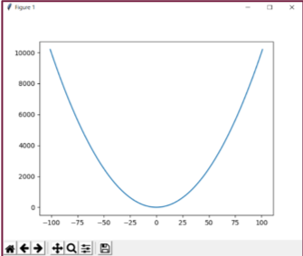

<p>
    
    <br>
    Andrew Janke<br>
    Michael Patterson<br>
</p>
<br>

   ____________________________________________

# Plotting

As you might expect, Python offers numerous libraries with which to
create graphical output. You'll want to have a look at
[Plotly](https://plot.ly/python/),
[Chartify](https://labs.spotify.com/2018/11/15/introducing-chartify-easier-chart-creation-in-python-for-data-scientists/),
and [Seaborn](https://seaborn.pydata.org/index.html), among many others.
One of the most popular libraries is, naturally,
[Matplotlib](https://matplotlib.org/), a library that tries to reproduce
MATLAB's charting capabilities.

Let's look at an example.

```python
C:> pip install matplotlib # from a Windows terminal

>>> import matplotlib.pyplot as plt
>>> x = list(range(-100,101)
>>> y = [x**2 for x in x]
>>> plt.plot(x,y)
```




Matplotlilb provides 2-d charts, but
other packages built upon Matplotlib provide 3-d charts, as per the
following example.

```python
>>> from mpl_toolkits.mplot3d import Axes3D
>>> import matplotlib.pyplot as plt
>>> from matplotlib import cm
>>> from matplotlib.ticker import LinearLocator, FormatStrFormatter
>>> import numpy as np
>>> fig = plt.figure()
>>> ax = fig.gca(projection='3d')
>>> X = np.arange(-5, 5, 0.25)
>>> Y = np.arange(-5, 5, 0.25)
>>> X, Y = np.meshgrid(X, Y)
>>> R = np.sqrt(X**2 + Y**2)
>>> Z = np.sin(R)

>>> surf = ax.plot_surface(X, Y, Z, cmap=cm.coolwarm, linewidth=0, antialiased=False)
```


-   There are many examples on the web that illustrate Python's
    graphing capabilities. Rest assured that you can create all the
    charts you've grown accustomed to with MATLAB.

-   Additional packages provide the ability to make interactive charts,
    to add filters, and to create dashboards.

-   For statistical charts, you'll want to check out the [seaborn
    package](https://seaborn.pydata.org/index.html), which is built on
    top of Matplotlilb. The [seaborn
    gallery](https://seaborn.pydata.org/examples/index.html) has a
    collection of charts that are readily available to you.

-   Lastly, as an open source language Python enjoys a wide audience of
    contributors. Chart types for many specific data sets have been
    contributed to the library of packages. Have a look at Yan Holtz's
    [Python Graph Gallery](https://python-graph-gallery.com/) for an
    overview of the chart types available in Python.

[](03-Control-Structures.md)
&nbsp; &nbsp; &nbsp; &nbsp;
[](05-Classes.md)
