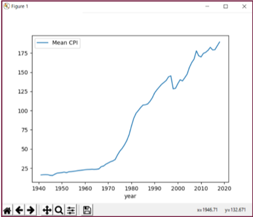

<br>
<br>

# The Python Ecosystem

As a MATLAB programmer you may be a little nervous about Python at this point.
We covered the primary data types and built-in functionality, but said nothing
of matrices, multi-dimensional arrays, array operations or vectorization. We
haven't even mentioned common mathematical operations such as matrix inversion,
eigenvalue computation, interpolation or the like.

The closest we came to any of those discussions was to introduce lists, and we
noted that lists are like MATLAB's cell array. But we also noted that Python
lists do not support matrices or higher-dimensional arrays. The core Python
language simply does not replicate the MATLAB features you rely upon. But fear
not, for Python is designed to be an extensible language and its ecosystem
provides the data types and functionality you've been wondering about.

The Python ecosystem, the libraries, IDEs and tools that complement the Python
language is vast. We noted earlier that learning the Python language requires a
substantial, yet limited, amount of your time. In contrast, discovering all that
is available in the Python ecosystem is, well, good luck with that. In the
following sections, we will introduce you to those portions of the ecosystem
that are likely to be of value to you. We cannot cover everything that might be
of interest to you, but we'll start the conversation and provide you with links
to additional material.

### Integration with Source Code Control

Python itself does not integrate with source control systems, but many of its
IDEs do. PyCharm, for example, has an intuitive interface to more than ten
source control systems, including GitHub, CVS and Subversion. In PyCharm, go to
File->Settings->Version Control and choose your SCC of preference. Once your
settings are made, there's a VCS menu on the PyCharm toolbar. It's that easy.
Note that file names within the project listing (left side of the PyCharm
window) are color coded to reflect their SCC state.

### Back to Modules and Packages

As mentioned earlier, a searchable list of 150,000 Python packages is available
at the [Python Package Index](https://pypi.org/). Before reinventing the wheel,
search through the index to see if someone has already published the code you
need. Downloading packages is easy, and your IDE may make it trivial for you.
Let's talk now about importing modules and packages into your Python workspace.

-   In Python, a module is a .py file; an organizational unit.

-   A package is a collection of modules in a directory. A package
    will also contain a file called _init_.py.

-   The module name is the name of the file (minus the .py
    extension).

-   A module typically contains a set of function definitions but may
    also contain executable statements; these statements initialize the
    module and are executed only the first time the module is
    imported.

-   The base workspace is referred to as the *main* module.

-   An import introduces the referenced module name to the current
    symbol table and executes any executable statements at the top of
    the module.

-   Each module has its own symbol table. That table is called a *global
    table* and is used by each function in the module.  The scope of a
    global table is its module; modules cannot see one another's global table.

-   Packages provide a further separation of scope. Whereas modules
    each contain their own global variable scope (thus shielding each
    other from variable and function name collisions), packages shield
    one another from colliding module names.

-   Modules are imported with the *import* command.
    ```python
    >>> import statistics as stat
    ```

    The above will import (register) the statistics module, abbreviated as stat.
    This does not actually load the statistics functions into the current workspace.
    Rather, the command registers the names of the functions in the module, and
    makes them available with, e.g.,
    ```python
    >>> avg = stat.mean(x)
    ```

-   When you import a module, *all* of the functions it contains will be registered.
    This means that a .py file can contain multiple functions, and all will
    register.  Specific functions in a module can be imported with, e.g.,
    ```python
    >>> from statistics import mean
    ```

    The above will register the mean() function but will not register the module
    name.

-   On startup, Python loads the modules of its standard library. The following list
    comprehension will print the set of currently imported modules:
    ```python
    >>> import sys
    >>> [str(m) for m in sys.modules]
    ```

-   To determine which functions are defined in module, use the built-in dir()
    function. For example:
    ```python
    >>> import sys
    >>> dir(sys)
    ```
   We'll skip the output here, as it is lengthy.

To install packages, a utility called 'pip' is recommended. Here's how to use pip
to install the matplotlib package.

Find pip.exe on your computer; this executable should have installed as part of
the Python install. Add that directory to Windows' path variable. Just type
'Edit Environment' in the Windows task bar and you'll find the variable
editor. See the following link for
[instructions](https://pip.pypa.io/en/stable/).

In a command prompt window (Windows, not Python), enter the following:
```python
pip install matplotlib
pip freeze
```

Occasionally you'll want to upgrade the installed version of pip. To do so,
enter (in a command prompt window):
```python
pip install --upgrade pip
```

With thousands of available packages, one might expect that updates to various
packages happen all the time. However, only one version of a given package can
be installed in the same Python instance; that is, a specific package name can
be imported only once, even if there are multiple versions available. To enable
testing of new packages, and to enable version-dependent programs to run with
outdated packages, Python allows for *virtual environments*. A virtual
environment is just a directory tree containing a Python installation, along
with a set of version-specific packages.

Python itself can create virtual environments (also known as _venvs_), using the
command *venv*. Likewise, many IDEs can create such environments. If you are
using a venv, be aware that pip installs packages and modules local only to that
venv. That is, if you download a package specific to a venv, that package will
not be included with, or available to, the next venv that you create.

Virtual environments are very useful and provide a feature missing in MATLAB: an
ability to switch between different module and package versions for testing or
debugging.

### Path Management

You may have noticed that we've not mentioned path management. No doubt you
are aware that path management is important to MATLAB: classes, functions and
scripts must reside on the path, and file naming conventions must be followed.

In contrast, Python path management tends to be simpler. The path will likely be
shorter, more easily managed, and once a module is imported, *all* of its
functions are directly accessible. By default, the packages that you install
with the pip utility will reside in a single folder under the
Python installation folder. To list your specific site folder(s), perform the
following command:
```python
>>> import site; site.getsitepackages()
```
If you know the name of a specific package you've already installed, you can obtain
information about that package, including its installation directory. Use the following
command entered into a Windows command window to obtain information about a package named,
e.g., package-name:
```python
pip show package-name
```

If you are using a virtual environment, the `venv` tool or your IDE will create
its necessary virtual environment folders and update the path variable
automatically.

Here are the basics for viewing and modifying the Python search path.

-   The Python search path is saved in a variable called sys.path.

-   To view the directories currently on the path, you can use the
    following:
    ```python
    >>> import sys; print(sys.path)
    ```    

-   To append the system path, use, e.g.,
    ```python
    >>> sys.path.append('C:Temp')
    ```

### NumPy

We promised several times to show you how Python supports matrices,
higher-dimensional arrays, and associated numeric and scientific computations.
That time has arrived.

One of the design objectives for the core Python library was, and remains,
simplicity. Matrices and higher-dimensional arrays are thus provided by add-on
packages. By far the most popular package to provide an array feature is
*NumPy*. The NumPy package bills itself as *the fundamental package for
scientific computing with Python.*

We'll cover some NumPy basics, just to show you that MATLAB's array features are
available in Python. But for a full discussion of NumPy, you'll want to visit
the official [NumPy website](http://www.numpy.org/).

To begin, install NumPy.
```python
C:> pip install numpy # Enter from a Windows terminal
```

We'll focus on the a NumPy-specific data type called *ndarray*, which has an
alias called *array*. This data type provides storage for a
multi-dimensional array of homogeneous elements. Let's first create and print a
1-d array of integers:
```python
>>> import numpy as np
>>> a = np.array([1,2,3]) # Note that we input a list.
      # Omitting the brackets generates an error.
>>> print(a)
[1 2 3]
```

Create and print a 2-d array of integers. There are numerous ways to create
arrays in NumPy, and we'll explore a few of those.
```python
>>> a = np.array([ (0, 1, 2, 3),
...                (4, 5, 6, 7) ])
>>> print(a)
[[0 1 2 3]
[4 5 6 7]]

>>> a = np.arange(8).reshape(2,4) # Equivalent to the above

>>> a[0,0] # Single brackets now; different from core Python
1

>>> a[0,1] = 99
>>> print(a)
[[1 99 3]
[4 5 6]]
```

The array() function transforms sequences of sequences into two-dimensional
arrays, sequences of sequences of sequences into three-dimensional arrays, and
so on.

NumPy provides several functions that will immediately be familiar, for example:
zeros(), ones(), and linspace().

Regarding operations on arrays, NumPy performs elementwise computations by
default; linear algebra operations are obtained through special functions.
```python
>>> a = np.array([ (1,2,3), (4,5,6) ])
>>> a += 1 # An in-place operation, equivalent to a = a+1
>>> print(a)
[[2 3 4]
[5 6 7]]

>>> a *= a # Element-wise multiplication, equivalent to a =
a*a
>>> print(a)
[[4 9 16]
[25 36 49]]
```

Recall from earlier that Python uses the '+' symbol to concatenate arrays, even
numeric ones. NumPy overrides that behavior, giving you elementwise operations.
E.g.,
```python
>>> a + a
array([[ 8, 18, 32],
       [50, 72, 98]])
```

Now let's look at a matrix product, using the `@` operator. Rather than save and then print() the
result, we'll skip the save and allow Python to print to the screen.
```python
>>> a = np.array( [[1,2]
                   [3,4]])
>>> b = np.array( [[2,3]
                   [4,5]])
>>> a @ b
array([10, 13],
      [22, 29])
```

NumPy has dozens of functions with which to perform the usual array operations you
would expect of an analytics library. You can query an array size, reshape an array, extract elements or
slices, compute statistics such as cov, mean, std and var. With NumPy you can
perform linear algebra operations such as transpose, inverse and multiplication.
You can compute eigenvalues. You can sort and filter arrays. Logical operations
include the familiar any(), all() and where() operations.

By default, NumPy will operate on arrays element-wise. This is a departure from
MATLAB's vectorized operations. However, NumPy provides a vectorization feature
via its *vectorize* class. As a simple example, suppose you have a function
called add.py which inputs two numbers, adds them and returns the result. Below
is the function, and how you would vectorize it.
```python
>>> import numpy as np
>>> def add(a, b):
... return a+b

>>> add_v = np.vectorize(add) # Returns a function
>>> add_v([1, 2, 3], [4, 5, 6]) # Add two vectors
array([5, 7, 9])
```
While it's not a core topic of this article, we should mention that NumPy offers
a tremendous performance benefit to numeric calculations.  Calculations that you
might compute in pure Python can run 10x to 100x faster using NumPy.  This performance
improvement results from several key features of NumPy.  Consider the simple act of adding
two lists.  In pure Python, each element of the list will be a pointer to an object, a float or
an int, for example, with all of the attendent overhead of processing those objects.
In NumPy, those lists will be reduced to arrays of a homogenous data type, with far less
processing overhead.  Secondly, many NumPy functions are implemented in the C language,
compiled for speed.  And thirdly, with NumPy, high-level Python for-loops get pushed down into
the C libraries, with the latter being far faster than the former.

NumPy has much more to offer; we simply cannot cover all of its capabilities
here. But a bit of good news for you: with a MATLAB background you'll find that
the [NumPy documentation](http://www.numpy.org/) is familiar, and once you read
through its documentation you'll feel much more at ease with Python.  And if you
don't particularly like the NumPy language syntax, keep reading to the Pandas section.
Pandas is built on top of NumPy and provides a syntax you will be much more comfortable
with.

### SciPy

The NumPy package is built upon the core Python language and provides an
N-dimensional array type. The [SciPy package](https://www.scipy.org/) is built
upon the NumPy package and provides a tremendous breadth of mathematical,
scientific and engineering algorithms. SciPy is actually one component of a
larger ecosystem of packages, including: NumPy, Matplotlib, IPython, Pandas and
numerous others. Generally, when you import SciPy, you'll want to import NumPy.
Depending on your needs, you'll import the other packages as required. When you
import SciPy and its friends, you are creating a Python computational
environment that is similar to what you are accustomed to with MATLAB.

SciPy provides a collection of modules targeted toward science and engineering.
SciPy modules include algorithms for linear algebra, FFTs, integration,
interpolation, optimization, signal and image processing, differential
equations, statistics and more. SciPy also extends Python's computational
features by providing advanced charting, database interactivity and parallel
processing. SciPy can even read and write MAT-files.

Be aware that some SciPy functions also appear in NumPy, and there will be
non-trivial differences between them. This duplication exists for NumPy backward
compatibility reasons. A good guideline is to use NumPy for its
multi-dimensional array type, and SciPy for its algorithms.

The ecosystem built on SciPy is vast. Fortunately, the SciPy team maintains an
[extensive list](https://www.scipy.org/topical-software.html) that is
categorized by scientific discipline and computational topic. We encourage you
to browse through the offerings. But first, let's take a quick look at SciPY.

To begin, install SciPy.
```python
C:> pip install scipy # Enter from a Windows terminal
```

Let's solve linear system [A]{x} = {b}, where [A] and {b} are given as:


```python
>>> import numpy as np
>>> from scipy import linalg

>>> A = np.array([[1, 2], [3, 4]])
>>> b = np.array([[5], [6]])
>>> x = np.linalg.solve(A, b)
>>> print(x)
[[-4, ],
[ 4.5]]
```

Check that the solution is correct. Compare the multiplication of
`[A]{x}` to `{b}`.
```python
>>> Ax = np.dot(A,x)
>>> tf = all(np.equal(Ax, b))
>>> print('Solution matches:', tf)
Solution matches: True
```

The SciPy package has extensive functionality, and extensive documentation. The
online [documentation](https://docs.scipy.org) at scipy.org is excellent, and
you'll eventually find yourself spending time there.

### Pandas

Building on NumPy and SciPy is the [Pandas package](https://pandas.pydata.org).
Pandas is all about data analysis and modeling. The pandas website states,
pandas has 'the broader goal of becoming the most powerful and flexible open
source data analysis / manipulation tool available in any language.' Note that
the name *pandas*, by convention, is written in all lowercase.

If you rely upon MATLAB's @dataset or @table classes, or if you have coded your
own version of these classes, or if you need to analyze and model data, you'll
want to explore the pandas package. Pandas offers both a Series class for 1-d
data, and a DataFrame class for 2-d data. Each of these classes comes with
labels, indices, and broad functionality for data import and export, data
cleansing, analysis and modeling, charting and numerous other tasks.

Pandas depends upon and extends the NumPy package. Pandas does not depend upon,
but interoperates with, SciPy. It's quite possible that a lot of code you had to
write before in MATLAB simply goes away now, as the code has been written for
you in Python's NumPy/SciPy/pandas ecosystem.

Development of pandas began in 2008 at AQR Capital Management, and the library
was open-sourced in 2009. Pandas does many of the things that you've grown
accustomed to in MATLAB. It is difficult to reduce the list of pandas'
capabilities to a set that might be most important to you, but here's an
attempt.

Pandas can read data from a wide variety of data sources, including CSV and
other delimited files, Excel, databases, HDF5, HTML and JSON. Pandas has
facilities for storing variable-frequency timeseries data, both 1-d and 2-d, and
for managing timeseries data with operations such as filling, converting
frequencies, and date shifting. As with NumPy, pandas provides indexing and
slicing of your data, and numerous relational operations such as group by, join
and merge. Data and axes can be labeled and indexed. Pandas provides facilities
for data analysis and modeling, and pandas interoperates with the functions
provided by SciPy.

Let's try an example using pandas. Suppose you notice a news article about the
Consumer Price Index (CPI) for U.S. Housing and want to explore some of that
data. An online search leads you to the [Bureau of Labor
Statistics](https://www.bls.gov/) and to a set of csv files on their website. In
the following code, we'll read the CPI data, explore it, reduce its frequency
from monthly to annual, and then chart it.

To begin, install pandas.
```python
C:> pip install pandas # Enter from a Windows terminal
```

Next, let's read the online data, and take a quick look at the
contents:
```python
>>> import pandas as pd

>>> URL =
'https://download.bls.gov/pub/time.series/cu/cu.data.12.USHousing'
>>> df = pd.read_csv(URL, sep='t') # df is short for
DataFrame
>>> df.head()

series_id year period value

0 CUSR0000SAH 1967 M01 30.5
1 CUSR0000SAH 1967 M02 30.5
2 CUSR0000SAH 1967 M03 30.5
3 CUSR0000SAH 1967 M04 30.6
4 CUSR0000SAH 1967 M05 30.7
```

Pandas was able to read the csv file and place it directly into a DataFrame.
Note that Pandas added the first column (a row index) automatically. We won't
need the series_id column, so let's drop it. Also, it turns out that the CPI
data is rather sparse before 1940, so let's keep only years 1940 and later:

```python
>>> df = df.drop('series_id', axis='columns')
>>> df = df[df.year >= 1940]
```

The column labeled 'period' denotes a month. E.g., M01 is January, M02 is
February, etc. Let's use some of panda's built-in SQL functionality to group the
CPI indices by year, taking the mean CPI across the months of each year. Note
how we are chaining operations together:
```python
>>> df = df.groupby(['year']).mean()
```
Finally, let's clean up the column labels and plot the data:
```python
>>> df = df.rename({'value':'Mean CPI'}, axis='columns')
>>> df.plot()
```

<div style="text-align: center;">



</div>
<br>

Plotting the data provides the figure above. Several comments are warranted
here. First, the pandas library was able to successfully load a remotely-hosted
data set that we did not even bother to pre-inspect. Pandas placed the data into
its DataFrame object, automatically included labels and inserted a row index.
Using pandas' functionality, we were then able to remove unwanted data, both
rows and columns, reduce it to an annual frequency, clean up the labels and
plot. We used a total of nine commands.

While pandas' syntax differs from MATLAB's, the commands we used to analyze the
CPI data should feel familiar. Pandas has a tremendous amount of functionality
that we've not touched upon, but hopefully we've demonstrated that the
combination of Python/NumPy/SciPy/pandas provides an analysis environment
similar to what you use with MATLAB.

<br>
### Full-Stack Python

Full-Stack Python refers to the design and deployment of web-based applications with significant server-side functionality.
Using nothing *but* Python and supporting Python-based libraries, one can create complex web apps which integrate into traditional websites and back-ends.  Python libraries are available for web frameworks (e.g., [Django](https://www.djangoproject.com/) and [Flask](https://flask.palletsprojects.com/)) and front-end user interfaces (e.g., [Plotly Dash](https://plotly.com/dash/)).

As an example, one of the authors of this article (Patterson) has written a web app for stress-testing trading portfolios comprised of options, futures, and swaps.  This app employs complex mathematical modeling, large data sets, extensive computations, and a sophisticated user interface.  The app is written completely in Python.  A screen shot is shown below, and the app is also [available online](https://aftermathematics.appspot.com/riskmanager/).

<div style="text-align: center;">

</div>
<br>

As shown above, Python can handle both the front-end and back-end of a web app, and also everything in between, such as analytics and database access.  Rather than belabor this topic, we'll refer you to an excellent online resource called, appropriately, [Full Stack Python](https://www.fullstackpython.com/) written by Matt Makai.

### MATLAB and Python, Together

The next item in the Python ecosystem that we'd like to introduce is one that
will be familiar to you: MATLAB. It may seem odd to include MATLAB as part of
the Python ecosystem, but the two languages play supporting roles to one
another. If you happen to own a MATLAB license, why not employ it as part of
your Python programming efforts?

Python can call MATLAB scripts and functions. In fact, The MathWorks has
published an [API for
Python](https://www.mathworks.com/help/matlab/matlab_external/call-matlab-functions-from-python.html)
package that you can import into your Python workspace to facilitate such calls.
The package enables you to launch MATLAB from a Python script, transfer data to
the MATLAB instance, invoke functions, and return results.

Why, you might ask, would you want to call MATLAB scripts from Python? We think
there are several use cases. The first is one of deployment. Suppose you have
analytics functionality built in MATLAB but want to deploy those analyses on the web. Python
has, though we've not discussed it here, state-of-the-art GUI toolkits that can
easily be deployed on AWS, the Google Computing Platform or otherwise. You can
construct your analytics front-end in Python, allowing it to communicate with
your MATLAB-based back-end library.

A second use case is one of developer efficiency. The knowledge you've obtained
in MATLAB continues to be valuable: you may have an extensive library of M-code
that you cannot justify recreating, or perhaps you have a wealth of experience
with a MATLAB toolbox and don't want to relearn that in a new language. In these
situations, you'll want to retain your work in MATLAB even as you branch out in
Python.

Just as MATLAB is part of the Python ecosystem, the reverse is also true: Python
is part of the MATLAB ecosystem. This latter perspective may be the one that
best applies to you. We're happy to report that you can experiment with Python
as a programming language without leaving your established MATLAB-based
platform.

Your MATLAB scripts can call newly developed Python code, and the MathWorks has
[published
functions](https://www.mathworks.com/help/matlab/getting-started-with-python.html)
to facilitate that interaction. Why, you might ask again, would you want to call
Python scripts from MATLAB? The answer is that Python does some things very
well, such as reading online data sources and databases. The possibilities here
are unlimited and depend upon your specific needs. As we stated in the beginning
of this article, knowing both languages will provide you with opportunities not
previously imagined.

## Integrated Development Environments (IDEs)

Let's return to a topic that we first discussed at the very beginning of the
article: IDEs. There are at least [twenty
IDEs](https://wiki.python.org/moin/IntegratedDevelopmentEnvironments) to choose
from. One called *IDLE* ships with the Python download but is limited in
functionality. If you choose to begin developing with Python, you'll want to
upgrade to one of the other choices.

The authors sometimes use the community (free) version of
[PyCharm](https://www.jetbrains.com/pycharm/). We also use the Professional (not
free) version. PyCharm provides code completion, code formatting, syntax
highlighting, runtime error checking, project navigation, debugging, and a slick
interface. PyCharm integrates with several source control libraries, unit
testing frameworks, databases, virtul environments and the [PyPy](http://packages.pypy.org/) package
management library. PyCharm also integrates with the scientific libraries we've
discussed in this article and supports the IPython magic commands. PyCharm is
every bit as sophisticated as the MATLAB IDE, and even more so.

If you happen to use Visual Studio, you can stay with that editor as it
supports Python. And if you're more of a command-line person, have a look at
[IPython](http://ipython.org/), which is a Python prompt with auto-completion,
history and shell capabilities.

Lastly, we mentioned earlier that an IDE called *Spyder* is available, and it
provides a programming environment similar to MATLAB's. From the [Spyder
website](https://www.spyder-ide.org/):

> Spyder is a powerful scientific environment written in Python, for
> Python, and designed by and for scientists, engineers and data
> analysts. It offers a unique combination of the advanced editing,
> analysis, debugging, and profiling functionality of a comprehensive
> development tool with the data exploration, interactive execution,
> deep inspection, and beautiful visualization capabilities of a
> scientific package.

Spyder has many features you'll recognize. Advanced editing features include
syntax highlighting, real-time code analysis, code cells, on-demand completion,
tool tips, window-splitting and more. The IDE includes a debugger and profiler,
interactive execution, a variable explorer, data explorer and visualizer, and
version control. The Spyder [IPython console window](https://ipython.org) will
assist you with function tips, automatic indentation, syntax highlighting and
command history. You can open multiple console windows, and each will operate
independently of the others.

Spyder is similar to PyCharm but targeted to data scientists and analysts.
Spyder even knows about and integrates with NumPy, SciPy, and Pandas.

Pictured below is Spyder along with our earlier example of using Pandas to
visualize BLM data. The window on the left is the editor displaying our code. To
the bottom-right is the Python console, along with integrated graphics. At the
top-right is the variable explorer; superimposed upon it is the output DataFrame
which we obtained by double-clicking on that variable in the explorer window.


Spyder is written in the Python language, is open source and is free of charge.

### Anaconda

Spyder is a core component of a Python distribution called
[Anaconda](https://www.anaconda.com/). The Anaconda distribution mimics a MATLAB
installation, in that it provides a complete computing environment: the Python
engine, all of the packages we covered earlier, a package manager, the Spyder
IDE, and more. With the Anaconda distribution, you no longer have to go shopping
for all of these various components. Anaconda gives you the best of breed in
each category, all targeted toward data science.

In addition to Python, Anaconda includes [Jupyter
Notebook](https://jupyter.org/), which is a Python engine that allows you to
create interactive 'notebooks' of Python code, output of that code, any
associated charts, and inline descriptive text. These notebooks are great for
teaching and collaboration.

Anaconda is free and open source. In addition, the [Anaconda
Cloud](https://anaconda.org/) provides you with online storage to collaborate on
modules, packages, notebooks and environments. The Cloud is free for
publicly-shared projects. For a monthly fee you can host private collaborations.

With more than six million users, Anaconda is a popular distribution worthy of
your attention.
