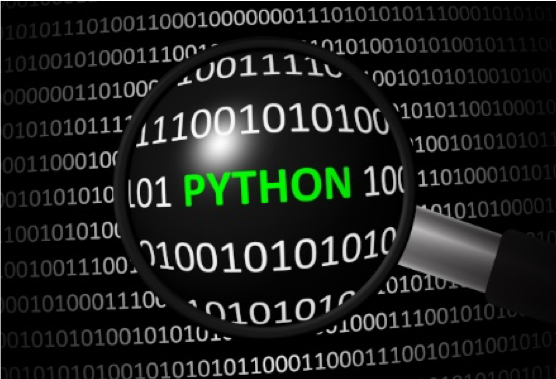

Python for MATLAB® Programmers  
==============================

Learning and Leveraging Python When You Know MATLAB




by Andrew Janke and Michael Patterson 

******************************************************

<a rel="license" href="http://creativecommons.org/licenses/by-sa/4.0/">

</a><br />
_Python for MATLAB Programmers_ by Andrew Janke and Michael Patterson is licensed under a
<a rel="license" href="http://creativecommons.org/licenses/by-sa/4.0/">Creative Commons Attribution-ShareAlike 4.0 International License</a>.

******************************************************

March 2019

This work was first published January 23, 2019.

The work was subsequently published to a [GitHub public repository](https://github.com/apjanke/PythonForMatlabCoders)
on March 31, 2019 under a Creative Commons Attribution ShareAlike 4.0 International License.  


******************************************************

# Introduction

If the title of this paper caught your eye, chances are you have
programmed in MATLAB for some time. You know the MATLAB language, the
development environment, and probably a few toolboxes. And yet you saw
the word *Python* in the title and kept reading.

Alongside MATLAB, Python has evolved into a powerful and popular
programming language. Python can interact with MATLAB, and thus could
augment or streamline some of your current MATLAB-based programming
efforts. That is, if only you knew more about the Python language.

This article's authors have more than thirty years combined programming
experience with MATLAB and numerous other languages. Over the past
several years we've also worked with Python, and we know firsthand that
there's room for the Python language in a MATLAB programmer's toolbox.
But to our knowledge nobody has written a comprehensive guide to help a
MATLAB programmer discover Python. Until now.

If you are a MATLAB programmer and you've been wondering what the
Python programming language is or if it might be of value to you, this
article is for you. If you want to learn about Python but don't want to
spend a week reading tutorials, this article is for you. We hope that by
the time you've read this article, assuming that you do, you'll agree
that we've provided a quick way to discover Python given your
background in MATLAB programming.

## Objectives of this Article

Because MATLAB and Python have many similarities, and because you
already know the former, learning about the latter should come easy. The
primary objective of this article is to provide you with a quick,
familiar way of discovering Python. We will not try to present the
entire Python language; we'll instead focus on those parts most
relevant to a person coming from your background.

In addition to presenting the Python language we'll introduce the
Python ecosystem, a set of libraries and tools that provides Python with
features and capabilities you've come to enjoy with MATLAB. The Python
ecosystem is vast, and a second objective of this article is to filter
the ecosystem to those parts that will likely be of importance to you.

A third objective is to present you with an unbiased view of both
languages. There are plenty of websites and articles that claim to prove
one language is somehow *better* than the other; we find those
discussions to be subjective, biased, and often misrepresentative of one
or both languages. We will not suggest that you switch from one language
to the other. We find tremendous value in MATLAB, but we also find value
in Python. Each language has its strengths and the two products can
interoperate. So perhaps you'll find reasons to use both languages, as
we do.

A fourth, and last objective of this article is to be as brief as
possible. Python is already well documented, so this document strives to
be a quick read. Corrections, additions, suggestions, criticisms, etc.
should be directed to the authors.

Let's get started.

## Conventions

We will use only a few conventions in this document, again in the name
of simplicity. Code that you would enter in a Python console is prefaced
by the standard `>>>` Python prompt. Continuation lines are
prefaced by the standard `...` continuation marks.

On the rare occasion that we reference an operating system, we reference
only Windows even though Python also runs on Macintosh and Linux. We
believe that the Windows-based references are clear enough that
translating to the other operating systems will be straightforward.

# MATLAB and Python, at a High Level

Like MATLAB[^1], Python is an interpreted, interactive, object-oriented
programming language. MATLAB was first released in 1983; Python in
1991.  Both are extensible and designed for use by a wide audience.

You already know MATLAB's key characteristics. Let's assess, in as
non-subjective manner as possible, the high-level similarities of MATLAB
and Python.

-   Both languages are interpreted.

-   Both languages can be used in either interactive or batch mode.

-   Both languages have high-level data types, such as arrays and
    classes.

-   Both languages incorporate dynamic, run-time variable typing.

-   Both languages and associated ecosystems are well documented.

-   Both languages are extensible in C and C++. Both can also be used as
    an extension to other languages.

-   Both languages can call one another.

Clearly the two languages have numerous similarities. But these are
different languages, designed by different people with different design
objectives and different target audiences. Each language has its own set
of strengths and weaknesses. Some of the key differences between the two
languages are as follows; again, we will strive to be as objective as
possible.

-   MATLAB is targeted to an audience of engineers and scientists;
    Python is more closely targeted to a computer science crowd.

-   Once installed, MATLAB provides not just a programming language; it
    offers also a complete programming environment. Python is more
    modular: once installed, you'll need to go shopping for supporting
    modules and an Integrated Development Environment.

-   MATLAB expresses linear algebra and array computations with notation
    that mimics mathematical formulas. This is quite powerful for
    scientists and engineers. In contrast, the Python language does not
    offer a mathematics-based language. But the Python language is
    elegant, terse and very readable.

-   MATLAB has an extensive library of built-in functions, control
    structures, and a sophisticated object model. Python, in contrast,
    has fewer built-in functions and control structures, and a simpler
    object model. Which is better? One is more powerful out of the box;
    the other is easier to learn. You get to choose.

-   In contrast, Python has more sophisticated features for exception
    handling. Again, more powerful is good, but a shorter learning curve
    is too.

-   Both languages have numerous add-on libraries (Toolboxes or
    Modules).  Python has more add-on libraries, but the MATLAB
    libraries are commercially developed, integrated with one another,
    fully tested and documented, and supported by dedicated teams.
    Python libraries are developed in an open source environment; such
    development efforts can produce excellent software, but users need
    to verify the quality of the software they are considering.

The list goes on. Assuming you have access to both languages, you can
use both to extract the best of each. Let's look at a few more
differences that you'll eventually want to consider.

-   One major difference between MATLAB and Python is in their
    respective licensing models. MATLAB is commercial software and can
    be obtained only by paying a license fee. Python is copyrighted but
    is open source and free for both personal and commercial use.

-   As already mentioned, MATLAB installs as a complete programming
    environment. But Python is a component of a larger ecosystem. 
    Python can be used for system admin, network admin, building web
    pages, and more.

-   Python is at home on the web; that is, Python apps are easily hosted
    as web apps.  MATLAB apps can also be hosted as web apps, but this
    requires more work.

-   Like MATLAB, Python supports single- and multi-dimensional arrays,
    and has extensive functionality to perform numerical and scientific
    computing. But unlike MATLAB this support is not part of the core
    product. Python obtains this support from add-on libraries.

-   Unlike MATLAB, Python is multi-threaded.  The core Python language
    is single-threaded but module support of coarse-grain
    multi-threading is available.

Lastly, let's consider the two languages from the point of view of a
typical MATLAB programmer (assuming we can stereotype here). Each
product supports timeseries data and has several date and time-specific
data types. Each provides extensive mathematical and scientific
libraries. Each provides access to a wide collection of linear algebra
algorithms. Each provides extensive charting capabilities, including
geospatial charting. Each can compile source code to P-code. This list
too, goes on.

In the end, MATLAB and Python differ in many implementation details but
provide many common capabilities.

# Installation

Python is available for the Windows, MacIntosh and Linux operating
systems. The installation process is simple: just
[download](https://www.python.org/downloads/) the installer and click
through its prompts. Note that both x86 and x86-64 versions are
available. Grab whatever latest version is appropriate for your
computer.

# Integrated Development Environments (IDEs)

You may eventually want an IDE, and there are numerous to choose from.
The [Wiki
pages](https://wiki.python.org/moin/IntegratedDevelopmentEnvironments)
at python.org list approximately twenty IDEs. One that will likely be of
interest to you is [Spyder](https://www.spyder-ide.org/), which provides
a programming environment similar to MATLAB's. Be aware that some
Python IDEs are quite sophisticated and are not trivial to learn. For
the purpose of running this article's code snippets, you have two
simpler options.

First, an IDE called IDLE ships with the Python download. This IDE is
limited in functionality but sufficient for our present needs. To run,
first install Python as per the above instructions. Then open a command
window and enter *idle*. There's some trial and error in learning how
to enter commands and code blocks into IDLE, but you'll catch on
quickly.

Alternatively, you can skip the Python install and run Python commands
online at any of a number of websites that provide a Python engine. One
such website is [Repl.it](https://repl.it/repls/SlategreyGloomyLava).
The learning curve is shorter with this approach, and no installations
are required.

For the moment, we recommend that you either use an online Python
engine, or simply postpone your decision until later. We will return to
the IDE topic in the chapter titled, *The Python Ecosystem*. At that
time, you'll understand why we suggest you delay this decision.

# Python Modules and Packages

Python uses *modules* and *packages* in the same way that MATLAB uses
M-files and toolboxes. A module is a file of Python code with a file
name that ends with suffix .py; a package is a directory of modules.
There are so many modules and packages publicly available that
discovering them requires an investment of your time.

A list of public modules is available at the PSF [Module
Index](https://docs.python.org/3/py-modindex.html). A searchable list of
packages is available at the [Python Package Index](https://pypi.org/).
How many packages are available, you ask? Nearly 150,000 as of late 2018.
Again, the Python ecosystem is quite large. From the PSF website,
the most commonly used packages include:

-   [NumPy](http://www.numpy.org/): a library which provides arrays to
    support advanced calculations

-   [SciPy](https://www.scipy.org/): a library for mathematical,
    scientific, and engineering computations

-   [Pandas](http://pandas.pydata.org/): a library for data structures
    and data analysis

-   [Matplotlib](https://matplotlib.org/): a 2-d plotting library with a
    MATLAB-like interface

-   [TKinter](https://wiki.python.org/moin/TkInter): de-facto GUI
    building interface

-   [IPython](http://ipython.org/): an interactive console, and tools
    for parallel and distributed computing

Most (perhaps all) of the MATLAB toolboxes have been reproduced as
Python packages. Even the MathWorks' flagship product Simulink has a
companion Python package called [bms](https://pypi.org/project/bms/). On
the Package Index website, you'll find packages for curve fitting,
statistics, mapping, analyzing text, AI, image processing, among
hundreds of topics.

Be aware that Python packages are developed in an open source
environment. Generally, these efforts produce quality software but there
are no guarantees. In contrast, MATLAB toolboxes are written by
professional software developers at the MathWorks, and the quality of
their software is usually excellent. When selecting Python packages,
it's a good practice to look for the project's development page to
gauge its member involvement, project maturity, and bug reports. Most
Python projects are hosted on [GitHub](https://github.com/).

To register a module in the current workspace, Python uses an *import*
statement. Importing a module is similar to adding a folder to the
MATLAB path: each process makes additional definitions and logic
available to the current workspace. We'll discuss the importing of
modules and packages in great detail later on. For the moment, just know
that when you see an import statement in the following examples, we're
registering Python files in the current workspace.

# The Python Style Guide

Python is a terse, whitespace-sensitive language. A key objective of the
language is to be readable, and toward that goal the language adheres to
[PEP8: The Style Guide for Python Code](https://pep8.org/). Here, PEP is
an acronym for *Python Enhancement Proposal*. Many languages have
preferred styles, but Python demands many of its style specifications.
Blank lines and indentations are important, and their proper use is not
optional. Eventually you will want to read the style guide, but early on
you can also allow an IDE to enforce the required conventions.

# Getting Help

There will be times when reading this document that you'll want
additional information on a data type, function or class. Python gives
you several sources of help. Suppose you want information about the
int() function. From a Python console you can type:

```
int?
help(int)
```

The first command will provide you with a brief overview of the
function. The second command will provide a broader discussion. If you
are using an IDE which is IPython-based, you can also enter the
following:

```
int?? # More details on the int() function

? # Help on IPython itself

%quickref # Quick reference on IPython
```

And of course, you can find online help at
[python.org](https://www.python.org/) or any of many Python-focused
websites.

# Python Types

In the following sections of this document we'll browse through the
Python language syntax. We will include code snippets, so if you've
installed Python on your computer you can try out the examples.

We'll start with data types, and later move into control structures.
Because we'll include code snippets below, you'll have a good feel for
the control structures before we arrive at that section. Later, we will
look at Python's object-oriented programming model. And lastly, we'll
look at select portions of the Python ecosystem.

## Numeric Types

MATLAB and Python have many similarities in their numeric types and
calculations upon those types. The core Python library defines fewer
types than MATLAB does, but add-on libraries will fill any voids you may
notice.

-   There are three distinct numeric types: int, float, and complex.

-   All of the usual calculations are supported, with the usual order
    of precedence.

-   The usual +, -, *, and / operations are supported.

-   There are other operations, again similar to MATLAB: remainder,
    floor, power, negation, etc.

-   Python also provides an abbreviated syntax for the above
    operations: +=, -=, *=, and /=.
    E.g., x += 1 is equivalent to x = x + 1.

-   Python has full support for floating point numbers, with mixed
    types converting integers to floating point.

-   Integers are not fixed width, as they are in MATLAB. Rather,
    Python integers are of arbitrary length, restricted only by your
    computer's memory.

-   In addition to decimal integers, Python supports binary, octal and
    hexadecimal.

-   Most Python implementations represent the float data type as a
    64-bit number. The maximum value allowed is approximately 1.8 X
    10^308. Larger values are represented by the string *inf*.

-   Python also provides numeric subtypes, meaning types derived from
    the primary types. Notable are Booleans, fractions, and decimal
    types.

## Booleans

MATLAB and Python have many similarities in their Boolean types.

-   Python provides a Boolean data type which can assume either of two
    values: True or False. Note that each value is capitalized. Booleans
    are a subtype of integers.

-   As with MATLAB, Python provides Boolean operators: and, or and
    not.

-   Python provides eight comparison operations: <, <=, >, >=, ==,
    and !=, is, and is not.

-   Comparison operations can be chained together. E.g., you can enter
    the following into a Python console, with the final line resulting:
```
>>> x = 10
>>> 5 < x < 15
True
```
    As another example, express the identity law of Boolean algebra:
```
>>> x + 0 == 0 + x == x == x*x/x
True
```

-   Most objects (class instances) will evaluate to True. The
    following evaluate to False:

    -   Keywords None and False

    -   Any numeric with a value of zero: 0, 0.0, 0j, Decimal(0) and
        Fraction(0,1)

    -   Empty sequences, including '', [], (), and {}. We'll
        cover sequences momentarily.

    -   User-defined objects can be instrumented to return False.

## Sequences

MATLAB is all about matrices; Python's closest match is a *sequence*.
The sequence data type is a building block to what MATLAB calls vectors
and arrays. For the moment we'll focus on Python's primary data types,
and later we'll return to the topics of vectors and arrays.

-   In Python, a sequence is a string, a list, a set or a tuple.
    We'll examine each of these in order, and we'll find common
    features in each.

-   Sequences are important: they are versatile, and all sequences are
    *iterable* objects. We'll cover iterables in more detail later on,
    but for now think of an iterable as an object capable of returning
    its members one at a time. As an example, a for-statement iterates
    over the items of a sequence. You can do the following:
```
>>> var = 'abc'   # Strings are iterable objects.
>>> for v in var: # Blocks of code are terminated with a blank line.
...   print(v)    # There are no end statements in Python. Nor do lines
                  # end with semicolons.
```

    The above lines of code will produce:
```
a
b
c
```

    In the above code, several coding conventions become apparent. The
    `>>>` mark is the Python console prompt. The `...` marks are
    continuation marks and are not something that you type into the
    console; they instead are *placed* there by the console to denote
    that the logical block is continuing; this is the convention of
    official Python documentation. A colon initiates a logical block of
    code, and that logical block of code is indented four spaces.
    Comments begin with a pound sign (#). Lastly, a blank line
    terminates a logical block.

-   Indentation is required, as it is how Python detects constructs. The
    standard convention is that an indent consists of four spaces,
    though you can choose any number of spaces greater than zero.

-   Python statements do not terminate with a semicolon, although they
    can to no ill effect. Unlike with MATLAB, omitting the semicolon
    will *not* echo the statement's result to the screen; with Python,
    you have to purposely print something to see its value.

-   We mentioned earlier that Python is a terse language. Iterables
    reflect that characteristic. A Python sequence is understood to be
    comprised of elements that can be acted upon individually. As such,
    looping constructs become easier to write.

-   All Python sequences employ zero-based indexing, as opposed to
    MATLAB's one-based indexing. Building on the example above:
```
>>> var[0]
    'a'
```

    The above example illustrates two departures from MATLAB
    conventions. First, Python uses zero-based indexing on all sequence
    types; MATLAB uses one-based indexing. Secondly, Python uses square
    brackets to encapsulate its indices; MATLAB uses parentheses. MATLAB
    is a bit of an outlier here, as most programming languages follow
    the Python conventions.
    
    Use of square brackets is a useful convention, as the brackets
    distinguish indexing from function or method calls. This is just one
    of many Python conventions that improve code readability.

Sequences are important: they provide built-in types such as strings,
lists and tuples. And sequences are a building block to many of
Python's derived data types such as vectors and arrays. We'll cover
the built-in sequence types first, and later return to the derived
types.

## Strings

The sequence *string* type is one that will be familiar to you. However,
specification of and operations on Python strings differ from what
MATLAB provides.

-   Use either single or double quotes to enclose a string. E.g.,
    
```
>>> str = 'abc'
```

-   Concatenate using a '+' sign; multiply with a '*' sign. E.g.,
```
>>> 2 * 'ab' + 'c'
'ababc'
```
-   When you need to create a long string and want to break it across
    several lines, you have several options. The preferred way, defined
    in [PEP
    0008](https://www.python.org/dev/peps/pep-0008/#maximum-line-length),
    is simply to enclose the string in parentheses. E.g.,
```    
>>> str = ('abc'
...        'def')
>>> str
'abcdef'
```    
    You can also continue a line with a backslash. E.g.,
```
>>> str = 'abc' \
... 'def'
```
-   Index reference a string with zero-based indexing, e.g.,
```    
>>> str[0] # All sequence data types employ zero-based indexing.
'a'
```

-   Multi-element indexing is called *slicing*, e.g., str[0:2].
```    
>>> str = 'ThisIsATest'
>>> str[0:4] # The upper bound is not included in the returned substring.
This
```
-   Strings are an [immutable](https://docs.python.org/3/glossary.html)
    sequence data type. Immutable types cannot alter their values once
    set. For example, the following series of commands will issue an
    error:
```
>>> str = 'abc'
>>> str[0] = 'A'
TypeError: 'str' object does not support item assignment
```    
    However, the following will work:
```  
>>> str = 'A' + str[1:3] # Note again that the upper bound is not included in the range
>>> str
'Abc'
```

The immutability property of strings may be disconcerting to a MATLAB
programmer who is used to changing strings with several of MATLAB's
built-in string processing facilities. Rest assured that Python
provides similar facilities via add-on modules.

-   Python provides several techniques for variable substitution and
    formatting in strings, but these differing methods appear to be
    converging onto a new technique called [*literal
    strings*](https://www.python.org/dev/peps/pep-0498/), or
    *f-strings*. Here's an example of variable substitution using an
    f-string:
    
```
>>> today = '01-Jan-2018' # There are date/time facilities for obtaining the current date
>>> print(f'The current date is {today}') # Note the prefix 'f' and the variable substitution
The current date is 01-Jan-2018
```
    
And here's an example of substitution and formatting within
f-strings:
    
```
>>> import math
>>> t = f'Pi = {math.pi:{4.3}}' # A string of length 4 with 2 significant digits
>>> t
'Pi = 3.14'
```
    
Python provides substantial capabilities for creating and printing
strings. It's a topic we'll have to leave for now, for space
considerations.

## Lists

The sequence *list* type is of great importance to a programmer that
knows MATLAB. A Python list is similar to a MATLAB cell vector and
provides a building block to numeric vectors and higher-order matrices
and arrays.

-   A list is a compound, mutable, sequence data type.

-   There are other compound data types, but the list is the most
    versatile.

-   By compound, we mean that a list's elements can contain
    heterogeneous data types.

-   Lists are also *ordered*, meaning that once the order of the list's
    elements is set, it will remain until purposely altered.

-   Lists are enclosed in square brackets. To create an empty list, use
    either of the following:
```
>>> x = []
>>> x = list()
```

-   Assign lists with a comma-separated set of elements in square
    brackets, e.g.,
```
>>> x = [0, 1, 2, 3] # Homogeneous list
>>> y = ['a', 'b', 1, 2, 3]. # Heterogeneous list
```    
    You will sometimes see a list defined across multiple lines, e.g.,
```    
>>> x = [1, 2, 3,
...      4, 5, 6,
...      ]
```    
    In the above, the IDE being used automatically added the `...`
    continuation marks, and also automatically indented the continuation
    lines. Note that we've included a trailing comma (after the six).
    Python allows this, as it makes it easier to add more lines of data
    later on, assuming that the above code was entered into an editor.
    When Python executes the above command, the line separations and
    trailing comma are removed. E.g.,
```
>>> x
[1, 2, 3, 4, 5, 6]
```
-   Lists, like all sequences, are zero-indexed, e.g., x[0].

-   As with strings, a *slice* of a list returns a portion of the
    original list, e.g.,
```    
>>> x = [0, 1, 2, 3]
>>> x[1:3] # The upper bound is not included in the returned slice
[1, 2]
```

-   Concatenate lists with the '+' symbol. E.g.,
```
>>> x = [0, 1, 2, 3, 4]
>>> y = x + [5, 6, 7, 8, 9]
[0, 1, 2, 3, 4, 5, 6, 7, 8, 9]
```    
    Note the consistency of syntax ('+' to concatenate).

-   The previous result will be unexpected for most MATLAB programmers.
    As shown in the example, Python did not interpret the '+' symbol
    to mean, 'add the two lists element-by-element' like MATLAB would.
    Rather, Python appended the second list to the first. This is the
    behavior of the core Python language. Later, we will show how you
    can obtain the more familiar vectorized operations.

-   Lists can also be appended with the append() method. E.g.,
    y.append(9). Note that the list type is a class and append() is a
    method rather than a function.

-   If a numeric sequence is desired, the equivalent of MATLAB's `y =
    1:10` in Python is `y = list(range(1,11))`. This is one of the few
    instances where Python is not particularly terse. One can also
    employ a *list comprehension* to create a sequence. We'll cover
    list comprehensions in a later section.

-   One can also embed lists within other lists. This is *sort of* like
    having a multidimensional array, but not quite equivalent. Consider
    the following:

```
>>> x = [ [ 1,2,3],
   [4,5,6],
   [7,8,9] ]
>>> x
[[1, 2, 3], [4, 5, 6], [7, 8, 9]]

>>> x[0][0]
1
```

For a programmer with a MATLAB background, lists may not appear
particularly useful. As an array, the list implementation would be
difficult to work with. Fear not, multidimensional arrays are available
in Python, and we'll cover that topic later.

## Sets

A set is an unordered collection of objects. Because sets have no order,
they cannot be indexed or sliced.

-   A set is a mutable sequence data type.

-   Define sets using a comma-separated list of heterogeneous items in
    braces. E.g.,
```    
>>> x = {'Dave', 'Tom', 'Mary', 'Dave'}
>>> x
{'Dave', 'Mary', 'Tom'} # Reordered and unique
```
-   The usual set operations are available. With sets one can test for
    membership, perform intersections, unions and differences. E.g.,

```
>>> 'Tom' in x
True

>>> x.union({'Grace'})
{'Dave', 'Grace', 'Mary', 'Tom'}
```
-   Python also supports a *frozenset* type, which produces an immutable
    set.

## Tuples

Tuples are another sequence data type. The tuple type is identical to
the list type, but immutable. By the way, the word *tuple* should be
pronounced to rhyme with *supple*.

-   A tuple is a compound, immutable, sequence data type.

-   A tuple can be created in numerous ways. E.g.,
```
>>> x = (1, 2, 3) # The parentheses are optional.
>>> x = 1, 2, 3
>>> x = tuple([1, 2, 3])
```

-   Tuples can have heterogeneous elements. E.g.,
```    
>>> x = ('y', 3, 4)
```
-   Tuples can employ parentheses on assignment, but require the usual
    square brackets on reference:
```    
>>> x[0]
'y'
```
-   Although tuples are immutable, their elements can be mutable objects
    such as lists.

-   Tuple assignment is also called tuple packing: `t = 1, 2, 3`.

-   The reverse is called tuple unpacking: `x, y, z = t`.

-   Multiple assignments on a single line is a special case of tuple
    unpacking: `x, y = 1, 5/3`. This is called, more generally, sequence
    unpacking, as the right-hand side of the assignment can be any
    sequence.

-   Tuples are often used in function signatures.

-   Tuples are iterables.

### Lists vs. Tuples

-   A list is a heterogeneous sequence of mutable objects.  Define the
    elements in a set of [].  Elements are operated upon one by one.

-   A tuple is a heterogeneous sequence of immutable objects.  Define
    the elements in a set of ().  Elements are operated upon as a group.

The key difference between lists and tuples is mutability. Use lists
when you might need to change, add or delete elements. Use tuples when
you want permanency, or when you need to create a composite key in a
dictionary, a data type we will discuss next.

## Dictionaries

Python dictionaries are similar to MATLAB structures. Here are the key
things to know about dictionaries:

-   Dictionaries are also referred to as an *associative array* or a
    *hash map*.

-   Dictionaries are a separate data type, often considered to be the
    most versatile Python data type.

-   More specifically, dictionaries are a mapping type, with an
    un-ordered, mutable set of key/value pairs.

-   Whereas sequences are indexed by a range of indices, dictionaries
    are indexed with keys.

-   Dictionary are mutable objects, but their keys must be immutable,
    e.g., strings or numbers.

-   Lists, because they are mutable, cannot be keys.

-   A few examples:
```
>>> phonebook = {'Joe': 1234, 'Bob': 5678} # Note the curly braces on assignment, like sets.
```
-   To insert or update an item, use square brackets for indexing,
    e.g.,
```
>>> phonebook['Grayson'] = 2513
```
-   A tuple can be used to create a composite key, if all of its
    elements are immutable. E.g.,
```
>>> phonebook[ ('Operator', 'Texas', 'Dallas') ] = 0
>>> print(phonebook)
{'Joe': 1234, 'Bob': 5678, 'Grayson': 2513, ('Operator',
'Texas', 'Dallas'): 0}
```
-   Use [] for list assignment, () for tuples, and {} for sets and
    dictionaries. If you forget which set of symbols produces which
    class, you can use the Python interpreter to remind you. E.g.,

```
>>> type([])
<class 'list'>

>>> type(())
<class 'tuple'>

>>> type({}) # Returns dict rather than set
<class 'dict'>

>>> type({1, 2, 3}) # Provide a better hint
<class 'set'>
```

For now, we are done with data types. We'll return to the topic later
when we discuss user-defined classes. Let's look next at Python's
primary control structures.

# Python Control Structures

Python's core library provides a limited but versatile set of control
structures. Add-on packages provide many additional constructs, but the
following discussion will be limited to those of the core library.

## Flow Control

Python provides the usual flow control constructs, with some minor
syntax changes.

-   Here is an if-statement:

```    
if x < 0:
  print('x is negative')
elif x == 0:
  print('x is zero')
else:
  print('x is positive')
```

-   Note again there's no end statement. Nor are there semicolons at
    the end of each line. Indentation is required, as it is how Python
    detects constructs. The Python style guide requests indents of four
    spaces, not a tab.

-   Python does not define a switch-case construct.

-   Python has only two looping constructs: the *while* construct, and
    the *for* construct. Here's a while-statement:
```
>>> x = 0
>>> while x < 10:
...   print(x, end=', ')
...   x = x+1
```

Here's a for-statement. Python will iterate over the items of any
sequence, as discussed earlier.
```
>>> for x in 'abcd':
...   print(x)
```
The above will print 'a', 'b', 'c', 'd' on separate lines.
The same construct works with lists:
```
>>> names = ['Dave', 'John', 'Mark']
>>> for x in names:
...   print(x)
```
The above will print 'Dave', 'John', 'Mark' on separate
lines.

The target list ('names' in the above example) is an iterable,
which serves up its elements one at a time. Note the similarities to
MATLAB, which can iterate in a for loop over a numeric array or a
cell array.

Wondering how to use indices in a for-loop? There are several ways,
and here is one example:
    
```
>>> N = len(names)
>>> for i in range(0,N): # range(0,N) produces the sequence 0, 1, 2, ..., N-1
...   print(i, names[i])
0 Dave
1 John
2 Mark
```

The range() function will return the sequence of values 0, 1, ...,
N-1. We'll see later that range() is an *iterable* object.

Using the enumerate() function, we can simplify the above loop and
obtain the loop counter:

```
>> for i, v in enumerate(names):
...  print(i,v)
```

When the list to print is instead a dictionary, an items() method
performs much the same role as the enumerate() function:

```
>>> names = {1: 'Dave', 2: 'John', 3: 'Mark'}
>>> for key, val in names.items():
...   print(key,val)
```

-   Within looping constructs, Python supports the usual *break* and
    *continue* statements.

-   Within for-loops, Python also supports an *else* clause: the else
    block will execute when the iterable has been exhausted, but not
    following a break statement. While-loops also support an else
    clause; here, the else block will execute when the while conditional
    becomes false.

## List Comprehensions

The list data type is a key element of the Python language. Recall
that a list is similar to MATLAB's cell vector. A construct called a
*list comprehension, or listcomp,* provides a compact syntax to create
one list from another, or from an iterable.

-   List comprehensions eliminate the for-loop side-effect of creating
    an index.

-   Syntax is a bracket, followed by an expression, followed by a
    for-clause, followed by an optional if-clause and then a closing
    bracket.

-   Nested for- and if-clauses are allowed.

-   A few simple examples:

```    
>>> Index = [i for i in range(10)] # Produces 0, 1, 2, ..., 9
>>> Squares = [x**2 for x in range(10)] # Produces 0, 1, 4, ..., 81
>>> Squares = [x**2 for x in range(10) if x != 5] # Skips x=5
```

-   The expression in a listcomp can be any expression, including
    another listcomp. Consider the following examples.
    
```
>>> x = [[0, 1, 2],
...      [3, 4, 5],
...      [6, 7, 8]]

>>> [row for row in x]
[[0, 1, 2], [3, 4, 5], [6, 7, 8]]

>>> [row[i] for row in x for i in range(3)]
[0, 1, 2, 3, 4, 5, 6, 7, 8]
```

The above is equivalent to the following:
```
>>> out = []
>>> for row in range(3):
...   for i in range(3):
...     out.append(x[row][i])
```

The following comprehension will transpose x. Note that the order of
nesting is reversed with this construct. In this example, the
expression is another listcomp, and is referred to as a listcomp
inside a listcomp.

```
>>> [[row[i] for row in x] for i in range(3)]
[[1, 4, 7], [2, 5, 8], [3, 6, 9]]
``` 

-   Dictionaries can also be assigned with list comprehensions:

```
>>> {x: x**2 for x in (2,4,6)}
{2: 4, 4: 16, 6: 36}
```

-   Lastly, it is possible to employ an if-else in list
    comprehensions. This is achieved though Python's [ternary
    conditional](https://docs.python.org/3/reference/expressions.html#conditional-expressions),
    an expression which takes the form:
```
>>> x if C else y # C is a conditional expression
``` 
    For example, suppose you have a dictionary d with a mix of integers,
    doubles and strings. If you want to convert all of the numeric types
    to type double, but leave the strings alone, the following will
    work:
```
>>> d = {x: (float(d[x]) if d[x]*0 == 0 else d[x]) for x in d.keys()}
```

# Iterables and Iterators

In Python every data type, whether built-in or user-defined, is a class.
Some classes have special capabilities, such as the ability of an object
to produce its data set one element at a time. Such an object is called
an *iterable*.

-   An iterable is an object which can return successive items of a
    sequence stored inside the object.

-   All sequence types are iterables. These include the types list,
    range, string, and tuple.

-   Sets and dictionaries are also iterables.

-   User-defined classes can be made iterable.

-   Iterables produce *iterators*, and it's the iterators that produce
    an object's elements.

-   Iterators have several methods defined for them, but the one you
    should know about is the *next()* method, which returns the next
    item in a list. Once a list's elements are exhausted, next() will
    issue an exception.

-   For example, let's create an iterator from a list, and then produce
    the list's elements.
```
>>> x = [0, 1, 2] # A list, which is an iterable
>>> it = iter(x) # An iterator
>>> next(it)
0
>>> next(it)
1
>>> next(it)
2
>>> next(it)
Traceback (most recent call last):
```

-   Some functions return an iterable. The range() function, for
    example, creates an iterable. We saw this earlier when discussing
    for-loops.

-   The function call `range(0,5)` creates an iterable object that will
    return [0, 1, 2, 3, 4] one element at a time.
    
```
>>> range(5) # This returns the object, an iterable
range(0, 5)

>>> list(range(5)) # This converts the iterable into a list
[0, 1, 2, 3, 4]

>>> it = iter(range(5)) # This converts the iterable into an
iterator
```
-   We also introduced the enumerate() function when discussing
    for-loops. The enumerate function returns an iterable that produces
    a list of tuples. Recall from our earlier example that the first
    element of each tuple will be a counter, and the second the value
    obtained from the iterable. E.g.,
```
>>> x = ['a', 'b', 'c']
>>> list(enumerate(x))
[(0, 'a'), (1, 'b'), (2, 'c')]
```
-   Iterables and iterators are pervasive in the Python language, as
    they provide memory efficient lists. You might not use them
    directly, deferring instead to for- and while-loops, but knowing how
    such constructs are implemented will be valuable to you.

## Generators

As mentioned in the previous section, user-defined classes can be made
iterable. This is, however, not Python's preferred way of creating an
iterator. There's quite a bit of coding involved with iterables, and
computational overhead too. *Generators* are the preferred way of
creating iteration-enabled objects. There are two types of generators.

-   First is a *generator function*, which is a user-defined function
    that provides a sequence much like an iterable does. Generator
    syntax, however, is much simpler than iterable syntax. We're not
    ready to discuss generator functions in depth, but for now know that
    you can easily create functions that produce a sequence of items one
    element at a time.

-   The second type of generator is the *generator expression*. These
    employ list comprehensions and iterables to create an expression
    which can later be executed.
```
>>> squares = (x*x for x in range(1,5)) # This produces, but does not execute, a generator object.
>>> list(squares) # This executes the object, saving the results as a list.
[1, 4, 9, 16]
```
    The first line of the above code looks like a listcomp, but it uses
    () rather than [], and that tells Python to create a generator. As
    before with iterators, we can iterate through a generator:
```
>>> squares = (x*x for x in range(1,3))
>>> next(squares)
1
>>> next(squares)
4
```
Generators are essentially lists that are awaiting completion. They are
memory efficient, and they are easy to store and to pass to methods and
functions.

## Lists, Revisited

Learning Python is a nonlinear process. As we learn more and more about
the language, we need to revisit earlier topics. Now that you know about
iterables, we should revisit list construction. Lists can be constructed
in multiple ways:

-   Using square brackets as discussed before. E.g., `x = [1, ,2, 3]`.

-   Using a list comprehension. E.g., `y = [x for x in range(4)]`.

-   Deferring construction with a generator. E.g., `gen = (x for x in
    range(4))`.

<!-- TODO: add example here -->
-   Using a constructor.

```
>>> list('abc') # Strings are iterables
['a', 'b', 'c']

>>> list( (1, 2, 3) ) # Tuples are iterables
[1, 2, 3]

>>> list( (x*x for x in range(1,5)) ) # Generators are memory-efficient
[1, 4, 9, 16]
```

Keep in mind that user-defined objects can be made iterable. We have
not covered such objects yet, but once we do, you'll see that their
contents can be converted into list objects.

## Functions

Python functions are similar to MATLAB functions, although Python
signatures are more versatile. Also, there are some interesting ways to
use and reuse functions in Python.

-   The basic structure of a function is:
```
def fun(arg1,arg2):
  """doc string""" # A doc string is roughly equivalent to a MATLAB H1 line.
  # Blank line before code begins
  code
  # Blank line to end the function
```
-   Function arguments are always *call by reference*. Python does not
    support *call by value*.[^2]

-   To return a value(s), Python does not support an `out = fun()`
    construct.  Instead, Python uses `return var` at the end of the
    function.

-   If a function returns no value, the built-in value 'None' is
    returned by default. The value None has a type of NoneType.

-   Function args can be given default values. E.g.,

```
def whats_your_name (prompt, retries=4, reminder='Please try again!'):
  """ doc string """
  # we'll skip the function's code for now
```
Default values are evaluated only once, and only at the point of the
function definition. As in the above, the arguments with default
values must follow any positional arguments. When defaults are
given, those arguments become optional for the caller.

-   Functions can be called with keyword arguments. E.g., to call the
    function just defined we could type:
```
>>> whats_your_name(prompt='Tell me your name', retries=10, reminder='Try again')
``` 
    Once a keyword argument is provided, all remaining arguments (if
    provided) must also be keyword arguments.

-   Function signatures are quite robust. Following positional arguments
    and arguments with defaults, one can pass an arbitrary number of
    arguments with the following construct:
```
def fun(arg1, arg2='test', *args):
```
    This is similar to MATLAB's vararg input. In the caller, following
    the positional and keyword arguments, one can pass an arbitrary set
    of comma-separated values. Inside the called function, the `*args`
    inputs will automatically be packed into a tuple named `arg` (in this
    example).

-   Expanding upon the above signature, one can also specify that a
    function is to receive an arbitrary number of keyword arguments:
```
def fun(arg1, arg2='test', *args, **keywords):
```
    The above listed order is required. If provided, the trailing
    keyword arguments will automatically be packed into a dictionary
    inside the function.

-   If a function signature requires individual args but the calling
    workspace has a list or tuple, the latter can be unpacked on the fly
    with a star ('*') syntax. For example:
```
>>> list(range(0, 3))
[0, 1, 2]
```
    The above is equivalent to
```
>>> x = [0, 3]
>>> list(range(*x))
```
    Dictionaries can also be unpacked, and that syntax uses a double
    star.

-   The execution of a function introduces a new symbol table used for
    the local variables of the function. Variable references in a
    function first look in the local symbol table, then in the local
    symbol tables of enclosing functions, then in the global symbol
    table, and finally in the table of built-in names.

-   Like everything else with Python, a function is represented
    internally as an object. That means you can do some interesting
    things with functions, like pass them into other functions. Consider
    the following simple example:
```
>>> def f(x): # Trivial function
...   return x+1
``` 
    The function f(x) is not just a function sitting in memory waiting
    to be invoked; it is an object in the workspace that can be passed
    around.
```
>>> f?
Signature: f(x)
Docstring: <no docstring>
File: c:usersownerdocumentspython...
Type: function
```
    Define a second function, which accepts the first function (or any
    function) as an argument:
```
>>> def g(fun, x): # Pass a function into a function
...   return 2*fun(x)
```
    It's a trivial example, but here's how the two functions work
    together:
```
>>> f(5)
6
>>> g(f,5)
12
```

-   Anonymous (unnamed) functions are created with the *lambda* keyword.
    E.g.,
```
>>> f = lambda x,y: x/y
>>> f(x=10, y=2)
5
>>> f(1000, 10)
100
```
    Such functions are commonly referred to as *lambda functions* or
    *lambda expressions*. As with nested functions, lambda functions can
    reference variables of the containing scope:
```
>>> def divideby(x):
...   return lambda y: x/y
```
    The above function returns a lambda object:
```
>>> divide10by = divideby(x=10)
>>> divide10by(5)
2
```
-   As mentioned earlier, functions are objects and can be passed around
    like data. This is powerful, and it will take some getting used to.
    Consider the following example, where we have a list of strings and
    we want to sort them, ascending order, by the number of unique
    characters in each string.
```
>>> str = ['cook', 'zoo', 'ohnoooh']
>>> str.sort(key=lambda x: len(set(x)))
>>> str
['zoo', 'cook', 'ohnoooh']
```    
    How did the above work? First, strings are a class, and that class
    has a *sort()* method associated with it. The sort() method allows a
    key argument, and we passed a lambda function as the value of that
    argument. In other words, we defined, on the fly, a function and
    then passed that function to the sort() method. For each element in
    variable str, the lamba function converted the string into a set,
    thereby removing duplicate letters, and then computed the length of
    the remaining characters. The length of the unique characters in
    each string then became the key by which to sort the list of
    strings.
    
    The above is equivalent to:
```
>>> [str[i] for I in [1, 0, 2]]
```
    This is equivalent, but assumes that we somehow know the sort order.
    Using the sort method and a lambda function in the first example, we
    were able to determine the sort order on the fly.

## Warnings

As with MATLAB, Python has facilities for warnings and exceptions
(errors). In fact, Python has sophisticated facilities for these.

Warnings are objects and derive from a Warning class. A list of built-in
Warning subclasses is available in the [Python Standard Library
documentation](mailto:https://docs.python.org/2/library/warnings.html).
Users can create their own warning classes, derived from the built-in
classes. A warning filter allows a user to process a warning through a
sequence of pre-defined categories of warnings, processing any match
that is found with specific actions. The filter can suppress a warning,
escalate it to an exception, or print it. For all the sophistication,
warnings can also be very simple:

```
>>> import warnings
>>> warnings.warn('Something seems wrong')
__main__:1: UserWarning: Something seems wrong
```

## Exceptions

Python's exceptions are a lot like MATLAB's error facility, but more
powerful. The syntax is similar, and we'll point out the differences.

Inside a program, a user might want to manually check for an error and
if encountered, issue an exception. Suppose you are about to compute the
standard deviation of a list of values, but you want to enforce a
minimum length to the list, e.g., ten data points. Your code would look
something like:

```
if len(x) <= 10:
  raise Exception('Too few data points')
```

The above block would raise (throw, in MATLAB terms) an exception.

Whereas MATLAB has try-catch blocks, Python defines try-except blocks.
Here's a quick summary:

-   Like warnings, each Python exception is a class. E.g., NameError or
    TypeError. There are dozens of built-in exception classes; you'll
    find a complete list in the [Python Standard Library
    documentation](mailto:https://docs.python.org/3/library/exceptions.html).

-   Exceptions can be user-defined and will derive from the built-in
    *Exception* class.

-   Try-except blocks have added functionality compared to MATLAB. The
    outline of a try-except block looks like:
    
```
try:
  # code
except NameError:
  raise Exception('Name is not defined.')
except ValueError:
  raise Exception('Value is not valid.')
else:
  # Code that is always executed if no exception is raised.
  # Useful for code that should not be part of the try-block.
finally:
  # Cleanup code that is always executed, regardless of whether an 
  # exception was encountered.
```
-   As in MATLAB, it is not necessary to specify the class of error.
    E.g., the following is permissible:
    
```
try:
  x = y / z
except:
  raise Exception('Looks like z was equal to zero')
```    

However, when you are monitoring for and handling specific types of
errors, use of a built-in or user-defined exception class is
recommended. E.g.,

```
try:
  x = y / z
except ArithmeticError:
  raise Exception('Looks like z was equal to zero')
```

-   As with MATLAB's throw() function, use Python's raise() function
    to issue an exception. Any associated arguments are available to the
    exception instance.

-   If you desire a stack trace and/or logging into a log file, use
    Python's logging module. E.g.,
    
```
import logging

try:
  y = 5 / 0
except:
  logging.exception('Division by zero')
```

-   Some objects have pre-defined clean-up actions that can occur
    regardless of any exception thrown (or not). An example is the
    opening of a file. A [*with*
    statement](https://docs.python.org/3/reference/compound_stmts.html#with)
    will ensure that pre-defined actions occur even if not explicitly
    requested. For example:
    
```
with open('some_file.csv') as file:
  for line in file:
    print(line)
```    
Following execution of this block of code, the opened file will be
closed regardless of whether an exception was raised. The *with*
statement is just shorthand notation for a try-except block, but
useful and convenient.

## Listing the Python Version

You'll need, from time to time, to know the version of Python that you
are using.

Here's how to get the version number from Python itself:
```
>>> import sys
>>> sys.version
3.7.0 (v3.7.0:1bf9cc5093, Aug 27 2018, 04:59:51) [MSC v.1914 64 bit (AMD64)]
```

And from a shell window, simply enter `python -V`.

## Interacting with the Operating System

Eventually you'll want to interact with the host computer's operating
system. Here's a sample of what you can do:

```
>>> import os
>>> os.getcwd()
>>> os.listdir()
```

You can change environment variables this way, change to a new
directory, etc. To see a list of all of the methods in the os module,
use dir(os).

## Miscellaneous

If you have been entering the above commands into a Python console
window, you might be wondering how to perform a few basic maintenance
operations, like listing or clearing the workspace variables. Python
itself does not provide these features, although you can certainly code
your own version of *whos* or *clear*. However, if you are using IPython
or an IDE built on IPython, you will have access to [magic
commands](https://ipython.readthedocs.io/en/stable/interactive/magics.html),
commands that will be familiar to you except that they are prefixed by a
'%'. Try the following:

```
>>> %who
>>> %whos
>>> %reset # Equivalent to MATLAB's *clear* command
```

There are a *lot* of magic commands, so you'll eventually want to
review those at the above link. You can also get magic command help from
the Python console with the following command:

```
>>> %magic
```

In addition to the magic commands, the IPython console (we're assuming
you'll eventually use this) provides an introspection facility that
helps you quickly examine any variable you have defined. For example,

```
>>> x = list(range(5))
>>> x? # Can also use >>> ?x

Type: list
String form: [0, 1, 2, 3, 4]
Length: 5
Docstring:
Built-in mutable sequence.
```

Introspection works with objects, built-in functions and user-defined
functions.

# Plotting

As you might expect, Python offers numerous libraries with which to
create graphical output. You'll want to have a look at
[Plotly](https://plot.ly/python/),
[Chartify](https://labs.spotify.com/2018/11/15/introducing-chartify-easier-chart-creation-in-python-for-data-scientists/),
and [Seaborn](https://seaborn.pydata.org/index.html), among many others.
One of the most popular libraries is, naturally,
[Matplotlib](https://matplotlib.org/), a library that tries to reproduce
MATLAB's charting capabilities.

Let's look at an example.
    
```
C:> pip install matplotlib # from a Windows terminal

>>> import matplotlib.pyplot as plt
>>> x = list(range(-100,101)
>>> y = [x**2 for x in x]
>>> plt.plot(x,y)
```


Matplotlilb provides 2-d charts, but
other packages built upon Matplotlib provide 3-d charts, as per the
following example.
    
```
>>> from mpl_toolkits.mplot3d import Axes3D
>>> import matplotlib.pyplot as plt
>>> from matplotlib import cm
>>> from matplotlib.ticker import LinearLocator, FormatStrFormatter
>>> import numpy as np
>>> fig = plt.figure()
>>> ax = fig.gca(projection='3d')
>>> X = np.arange(-5, 5, 0.25)
>>> Y = np.arange(-5, 5, 0.25)
>>> X, Y = np.meshgrid(X, Y)
>>> R = np.sqrt(X**2 + Y**2)
>>> Z = np.sin(R)

>>> surf = ax.plot_surface(X, Y, Z, cmap=cm.coolwarm, linewidth=0, antialiased=False)
```


-   There are many examples on the web that illustrate Python's
    graphing capabilities. Rest assured that you can create all the
    charts you've grown accustomed to with MATLAB.

-   Additional packages provide the ability to make interactive charts,
    to add filters, and to create dashboards.

-   For statistical charts, you'll want to check out the [seaborn
    package](https://seaborn.pydata.org/index.html), which is built on
    top of Matplotlilb. The [seaborn
    gallery](https://seaborn.pydata.org/examples/index.html) has a
    collection of charts that are readily available to you.

-   Lastly, as an open source language Python enjoys a wide audience of
    contributors. Chart types for many specific data sets have been
    contributed to the library of packages. Have a look at Yan Holtz's
    [Python Graph Gallery](https://python-graph-gallery.com/) for an
    overview of the chart types available in Python.

# Namespaces and Scopes

At this point of the article we'll dive a bit deeper into the
programming language. We'll discuss namespaces, scopes, and then
classes. Each of these differs from the MATLAB model, and you need to be
aware of the changes. Let's start with Namespaces and scopes, as these
concepts are important prerequisites for understanding classes.

-   A *namespace* is a mapping from names to objects, typically
    implemented as a dictionary. Examples include built-in names,
    exception names, global names of a module, and local names of a
    function.

-   Namespaces are implemented (currently, anyway) as dictionaries. The
    dictionary keys are variable names, and the associated values are
    the objects that the names point to.

-   In Python, a *global* namespace refers to the top-level space of a
    single module. The global namespaces of two or more modules are not
    shared.

-   Attributes of an object are effectively a namespace.

-   A *scope* is a textual region of a program where a namespace is
    directly accessible.

-   At any time during program execution, at least three scopes are in
    effect. From the innermost scope to the outermost, these are:

    1.  The scope of any embedded function (a function embedded in an
        enclosing function). When Python is trying to resolve a
        reference, this innermost scope of local names is searched
        first.

    2.  The scopes of enclosing functions, containing non-local, but
        also non-global names. When resolving references, this scope is
        searched second.

    3.  The next to last scope (the *middle,* or *global scope*)
        contains a module's global names.

    4.  The outermost scope (searched last) is the namespace containing
        built-in names.


-   Variables can be declared *global*, in which case they will reside
    in the middle scope and will not be shared across modules.

-   Variables outside of the innermost scope can also be declared
    *nonlocal*, whereby they will pass by reference into any innermost
    scope.

# Classes

For programming projects of non-trivial size, the use of classes is
considered standard practice. MATLAB provides a sophisticated class
model that, while offering programmers tremendous capabilities, is
difficult to learn. Python's class model is much simpler, offers fewer
capabilities, but is easier to learn. Let's have a look.

In the following, we'll make no attempt to explain object-oriented
programming; we are instead assuming you have covered this topic
elsewhere. We'll provide an outline of what Python offers, from as
usual, the perspective of a MATLAB programmer.

In Python *everything* is an object; in MATLAB most but not all
things are objects.

Let's look at a few simple Python examples of variables. Consider
the following:
   
```
>>> x = []
>>> x?
Type: list
String form: []
Length: 0
Docstring: Built-in mutable sequence.
```
    
As the above shows, even the [] construct creates an object.  In
this case, variable x is a list object. Or consider how a variable
containing an integer has a class attribute:

```
>>> x = 5
>>> x.__class__
<class 'int'>
```

-   Classes are defined with a straightforward syntax. In the following
    example code, we define a class, a docstring, an initiation method,
    and then two class methods:

```
def MyClass:
  """A sample class definition""" # Like MATLAB's H1 line

  def __init__(self): # A constructor
    self.mydata = []

  def method1(self):
    self.mydata = 3.14159

  def method2(self):
    self.mydata = 3.14159 / 2
```

Class objects support only two kinds of operations: attribute
references and instantiation. Let's look first at attribute
references. Consider the following class definition which defines
one attribute and one method:
  
```  
class MyClass:
  """Doc String"""
  x = 3.140

  def f(self,StringToPrint):
    print(StringToPrint)
```

Back in the Python console window, we can type the following:

```    
>>> import MyClass as mod
>>> obj = mod.MyClass()
>>> obj.x
3.14
>>> obj.f # This produces a function object
<bound method>

>>> obj.f('test')
'test'
```

Both the attribute and the method are referenced with the same
notation. Use of the variable 'self' as the first argument to the
above method is only a convention; this is, however, the standard
convention.

Now let's look at an instantiation operation. Python uses a
specifically named method for instantiation, called
`__init__`, as per the following example:

```
  def __init__(self, day, activity):
    self.weekday = day
    self.activity = activity
```

When a `__init__` method is placed into a class definition, it is
automatically invoked when the class is first instantiated.

-   Python supports class inheritance. The syntax is simply
    
```
class SubClassName(BaseClassName):
```
    
In the above, BaseClassName must be in scope. If it is not, one can
instead use

```
class SubClassName(modname.BaseClassName):
```

Subclass methods may either override or extend base class methods of
the same name. To call a super-class method from a subclass, use
super(). For example, if a parent class has a method called
invite(), the subclass can reference the method with
super().invite().

-   Python supports both class (static) and instance variables. The
    location where variables are defined in a class, rather than the use
    of keywords, dictates whether a variable is a class variable or
    instance variable. E.g.,

```
def MyClass:
  ClassVar = 3.14 # Class, or static variable

  def __init__(self):
    self.InstanceVar = 3.14159 # Instance variable
```

-   Python also supports static methods. This introduces the topic of
    Python's *class decorators*, which we consider to be an advanced
    topic best saved for later. But for now, know that Python supports
    both static and instance methods.

-   In MATLAB, a class resides in a file of the same name. In Python,
    multiple classes can be defined in one file, and that file can take
    any name. More generally, a class can be defined anywhere, e.g.,
    inside of a function or an if statement (not that you would do that,
    of course). Classes can be embedded within one another, with the
    inner class having access to the outer class namespace. The author
    of Python, Guido van Rossum, maintains a blog where he has an
    [interesting
    discussion](http://python-history.blogspot.com/2009/03/how-everything-became-executable.html)
    of this topic.

-   There are some significant differences between the MATLAB object
    model and Python's. Here are the biggest ones:

    -   MATLAB provides private attributes (for both properties and
        methods); Python does not.

    -   Further, MATLAB provides numerous property attributes such as
        Abstract=true. Python offers none of these.

    -   MATLAB also offers object events, or listeners; Python does not.

    -   MATLAB requires that a file can hold only one class; Python has
        no such restriction.

-   There are many more differences between the MATLAB and Python object
    models. In general, the Python model chooses simplicity over
    sophistication; vice-versa for MATLAB. Which model is the best
    choice will depend upon your programming needs.

## Mutability

Python considers everything to be an object. Once initiated, some
objects allow their state to be changed, meaning they are mutable. Other
objects prohibit state changes; these objects are immutable. Knowing
which classes are mutable and which are not is important. Here's a
reference list:

-   Mutable classes: list, set, dict and byte array

-   Immutable classes: bool, complex, float, int, str, tuple and
    frozenset

It may seem strange that Python defines so many immutable classes. But
beyond the primitive data types (bool, complex, float and int) only
three classes are immutable. And of those three, the tuple class allows
its contents to contain mutable objects.

## Copy That

To close out this chapter, let's discuss an interesting, and likely
unexpected, feature of Python: the language provides *three* mechanisms
for copying variables. We think it's best to inform you of this now, so
that you don't learn about this after tripping over it.

Suppose you have a list referenced by the variable x. If you then create
a new variable y with the operation y=x, the new variable y simply
points to original list; the variable y does not reference a new copy of
the list. This is an important concept to master as it effects all
Python data types. On assignment, Python will *bind* two objects
together rather than make a copy. Consider the following:

```
>>> x = [0, 1, 2, 3]
>>> y = x
>>> x[0] = 99
>>> y
[99, 1, 2, 3]
```

By updating x we also updated y, because y was *bound* to x. From the
MATLAB perspective, x and y are similar to handle objects; unlike
MATLAB, Python defaults to this behavior.

When necessary Python will allow you to make a true copy. But there are
two flavors of true copies. The first is called a [shallow
copy](https://docs.python.org/3/library/copy.html). For simple objects
like a list that don't contain nested objects, the shallow copy is all
you need.

```
>>> import copy
>>> x = [0, 1, 2, 3]
>>> y = x.copy()
>>> x[0] = 99
>>> y
[0, 1, 2, 3]
```

When you are trying to copy more complex objects, such as a user-defined
object whose attributes reference other objects, you will need a [deep
copy](https://docs.python.org/3/library/copy.html) of the list. In this
third case, use x.deepcopy() instead of x.copy().

An important exception to binding is in making array slices. When an
array is sliced, the returned object is a new object, not a view into
the original object. E.g.,

```
>>> a = list(range(5))
>>> b = a[2] # A slice, which is not bound to variable 'a'.
>>> b
2
>>> b = 99 # Change the value of b.
>>> a
[0, 1, 2, 3, 4] # Variable a is unaffected.
```

## Biggest Differences

Now that you've seen Python's primary data types and control
structures, let's catalog the major differences between the Python and
MATLAB languages. Here are the items that made our list. If you are
going to program in the Python language, you'll want to spend some time
studying these topics further.

-   Python array indexing: zero-based rather than one-based, and square
    brackets rather than parenthesis.

-   List comprehensions: there's really no equivalent in MATLAB.

-   Iterables, iterators and generators: an important feature of the
    Python language. MATLAB does not offer the feature, although you can
    code it yourself.

-   Mutability: this is an important concept in Python. This same
    concept exists in MATLAB, but programmers are largely shielded from
    and thus often unaware of it.

-   Bindings, shallow copies and deep copies: by default, Python treats
    objects like MATLAB handle objects.

We have now covered the primary Python data types and control
structures. In the third and last chapter of this article, we'll look
at the expansive Python ecosystem.

# The Python Ecosystem

As a MATLAB programmer, you may be a little nervous about Python at this
point. We covered the primary data types and built-in functionality, but
said nothing of matrices, multi-dimensional arrays, array operations or
vectorization. We haven't even mentioned common mathematical operations
such as matrix inversion, eigenvalue computation, interpolation or the
like.

The closest we came to any of those discussions was to introduce lists,
and we noted that lists are like MATLAB's cell array. But we also noted
that Python lists do not support matrices or higher-dimensional arrays.
The core Python language simply does not replicate the MATLAB features
you rely upon. But fear not, for Python is designed to be an extensible
language and its ecosystem provides the data types and functionality
you've been wondering about.

The Python ecosystem, the libraries, IDEs and tools that complement the
Python language is vast. We noted earlier that learning the Python
language requires a substantial, yet limited, amount of your time. In
contrast, discovering all that is available in the Python ecosystem is,
well, good luck with that. In the following sections, we will introduce
you to those portions of the ecosystem that are likely to be of value to
you. We cannot cover everything that might be of interest to you, but
we'll start the conversation and provide you with links to additional
material.

## Integration with Source Code Control

Python itself does not integrate with source control systems, but many
of its IDEs do. PyCharm, for example, has a very intuitive interface
with more than ten source control systems, including GitHub, CVS and
Subversion. In PyCharm, go to File->Settings->Version Control and
choose your SCC of preference. Once your settings are made, there's a
VCS menu on the PyCharm toolbar. It's that easy. Note that file names
within the project listing (left side of the PyCharm window) are color
coded to reflect their SCC state.

## Back to Modules and Packages

As mentioned earlier, a searchable list of 150,000 Python packages
is available at the [Python Package Index](https://pypi.org/). Before
reinventing the wheel, search through the index to see if someone has
already published the code you need. Downloading packages is easy, and
your IDE may make it trivial for you. Let's talk now about importing
modules and packages into your Python workspace.

-   In Python, a module is a .py file; an organizational unit.

-   A package is a collection of modules in a directory. A package
    will also contain a file called _init_.py.

-   The module name is the name of the file (minus the .py
    extension).

-   A module typically contains a set of function definitions but may
    also contain executable statements; these statements initialize the
    module and are executed only the first time the module is
    imported.

-   The base workspace is referred to as the *main* module.

-   An import introduces the referenced module name to the current
    symbol table and executes any executable statements at the top of
    the module.

-   Each module has its own symbol table. That table is the global
    table used by each function in the module.

-   Packages provide a further separation of scope. Whereas modules
    each contain their own global variable scope (thus shielding each
    other from variable and function name collisions), packages shield
    one another from colliding module names.

-   Modules are imported with the *import* command.
    
```
>>> import statistics as stat
```

The above will import (register) the statistics module, abbreviated
as stat. This does not actually load the statistics functions into
the current workspace. Rather, the command registers the names of
the functions in the module, and makes them available with, e.g.,
    
```
    >>> avg = stat.mean(x)
``` 

When you import a module, *all* of the functions it contains will
be registered. This means that a .py file can contain multiple
functions, and all will register.

Specific functions in a module can be imported with, e.g.,
    
```
>>> from statistics import mean
```
    
The above will register the mean() function but will not register
the module name.
    

On startup, Python loads the modules of its standard library. The
following list comprehension will print the set of currently
imported modules:

```
>>> import sys
>>> [str(m) for m in sys.modules]
```

To determine which functions are defined in module, use the built-in
dir() function. For example:

```
>>> import sys
>>> dir(sys)
```

We'll skip the output here, as it is lengthy.

To install packages, a utility called 'pip' is recommended.
Here's how to run it to install the matplotlib package.

Find pip.exe on your computer; this executable should have installed
as part of the Python install. Add that directory to Windows' path
variable. Just type in 'Edit Environment' and in the Windows task
bar and you'll find the variable editor. See the following link for
[instructions](https://pip.pypa.io/en/stable/).

In a command prompt window (Windows, not Python), enter the
following:

```
pip install matplotlib
pip freeze
```

-   Occasionally you'll want to upgrade the installed version of pip.
    To do so, enter (in a command prompt window): `python -m pip install
    --upgrade pip`
    

With thousands of available packages, one might expect that updates to
various packages happen all the time. However, only one version of a
given package can be installed in the same Python instance; that is, a
specific package name can be imported only once, even if there are
multiple versions available. To enable testing of new packages, and to
enable version-dependent programs to run with outdated packages, Python
allows for *virtual environments*. A virtual environment is just a
directory tree containing a Python installation, along with a set of
version-specific packages.

Python itself can create virtual environments, using the command
*venv*. Likewise, many IDEs can create such environments. If you are
using a VE, be aware that pip installs packages and modules local only
to that VE. That is, if you download a package specific to a VE, that
package will not be included with, or available to, the next VE that you
create.

Virtual environments are very useful and provide a feature missing in
MATLAB: an ability to switch between different module and package
versions for testing or debugging.

## Path Management

You may have noticed that we've not mentioned path management yet. No
doubt you are aware that path management is important to MATLAB:
classes, functions and scripts must reside on the path, and file naming
conventions must be followed.

In contrast, Python path management tends to be simpler. The path will
likely be shorter, more easily managed, and once a module is imported,
*all* of its functions are directly accessible. By default, the packages
that you install with the pip utility will reside in folder
LibSite-packages relative to the Python installation folder. To list
your specific site folder(), perform the following command:

```
>>> import site; site.getsitepackages() # A semicolon separates commands on a single line
```

If you are using a virtual environment, the `venv` tool or your IDE will
create its necessary virtual environment folders and update the path
variable automatically.

Here are the basics for viewing and modifying the Python search
path.

-   The Python search path is saved in a variable called sys.path.

-   To view the directories currently on the path, you can use the
    following:
    
```
>>> import sys; print(sys.path)
```    

-   To append the system path, use, e.g.,

```    
>>> sys.path.append('C:Temp')
```

## NumPy

We promised several times to show you how Python supports matrices,
higher-dimensional arrays, and associated numeric and scientific
computations. That time has arrived.

One of the design objectives for the core Python libpycrary was, and
remains, simplicity. Matrices and higher-dimensional arrays are thus
provided by add-on packages. By far the most popular package to provide
an array feature is *NumPy*. The NumPy package bills itself as *the
fundamental package for scientific computing with Python.*

We'll cover some NumPy basics, just to show you that MATLAB's array
features are available in Python. But for a full discussion of NumPy,
you'll want to visit the official [NumPy
website](http://www.numpy.org/).

To begin, install NumPy.
    
```
C:> pip install numpy # Enter from a Windows terminal
```

We'll focus on the a NumPy-specific data type called *ndarray*,
which has an alias called just *array*. This data type provides
storage for a multi-dimensional array of homogeneous elements.
Let's first create and print a 1-d array of integers:

```
>>> import numpy as np
>>> a = np.array([1,2,3]) # Note that we input a list.
      # Omitting the brackets generates an error.
>>> print(a)
[1 2 3]
```

Create and print a 2-d array of integers. There are numerous ways to
create arrays in NumPy, and we'll explore a few of those.

```
>>> a = np.array([ (0, 1, 2, 3),
...                (4, 5, 6, 7) ])
>>> print(a)
[[0 1 2 3]
[4 5 6 7]]

>>> a = np.arange(8).reshape(2,4) # Equivalent to the above

>>> a[0,0] # Single brackets now; different from core Python
1

>>> a[0,1] = 99
>>> print(a)
[[1 99 3]
[4 5 6]]
```

The array() function transforms sequences of sequences into
two-dimensional arrays, sequences of sequences of sequences into
three-dimensional arrays, and so on.

NumPy provides several functions that will immediately be familiar,
for example: zeros(), ones(), and linspace().

Regarding operations on arrays, NumPy performs elementwise
computations by default; linear algebra operations are obtained
through special functions.

```
>>> a = np.array([ (1,2,3), (4,5,6) ])
>>> a += 1 # An in-place operation, equivalent to a = a+1
>>> print(a)
[[2 3 4]
[5 6 7]]

>>> a *= a # Element-wise multiplication, equivalent to a =
a*a
>>> print(a)
[[4 9 16]
[25 36 49]]
```

Recall from earlier that Python uses the '+' symbol to concatenate
arrays, even numeric ones. NumPy overrides that behavior, giving you
elementwise operations. E.g.,

```
>>> a + a
array([[ 8, 18, 32],
[50, 72, 98]])
```

Now let's look a matrix product, using the `@` operator. Rather than
print() the result, we'll not save the result and allow Python to
print to the screen.

```
>>> a = np.array( [[1,2]
[3,4]])
>>> b = np.array( [[2,3]
[4,5]])
>>> a @ b
array([10, 13],
[22, 29])
```

NumPy has dozens of functions to perform the usual array operations
you might expect. You can query an array size, reshape an array,
extract elements or slices, compute statistics such as cov, mean,
std and var. With NumPy you can perform linear algebra operations
such as transpose, inverse and multiplication. You can compute
eigenvalues. You can sort and filter arrays. Logical operations
include the familiar any(), all() and where() operations.

By default, NumPy will operate on arrays element-wise. This is a
departure from MATLAB's vectorized operations. However, NumPy
provides a vectorization feature via its *vectorize* class. As a
simple example, suppose you have a function called add.py which
inputs two numbers, adds them and returns the result. Below is the
function, and how you would vectorize it.

```
>>> import numpy as np
>>> def add(a, b):
... return a+b

>>> add_v = np.vectorize(add) # Returns a function
>>> add_v([1, 2, 3], [4, 5, 6]) # Add two vectors
array([5, 7, 9])
```

NumPy has much more to offer; we simply cannot cover all of its
capabilities here. But a bit of good news for you: with a MATLAB
background you'll find that the [NumPy
documentation](http://www.numpy.org/) is familiar, and once you read
through its documentation you'll feel much more at ease with
Python.

## SciPy

The NumPy package is built upon the core Python language and provides an
N-dimensional array type. The [SciPy package](https://www.scipy.org/) is
built upon the NumPy package and provides a tremendous breadth of
mathematical, scientific and engineering algorithms. SciPy is actually
one component of a larger ecosystem of packages, including: NumPy,
Matplotlib, IPython, Pandas and numerous others. Generally, when you
import SciPy, you'll want to import NumPy. Depending on your needs,
you'll import the other packages as required. When you import SciPy and
its friends, you are creating a Python computational environment that is
similar to what you are accustomed to with MATLAB.

SciPy provides a collection of modules targeted toward science and
engineering. SciPy modules include algorithms for linear algebra, FFTs,
integration, interpolation, optimization, signal and image processing,
differential equations, statistics and more. SciPy also extends
Python's computational features by providing advanced charting,
database interactivity and parallel processing. SciPy can even read and
write MAT-files.

Be aware that some SciPy functions also appear in NumPy, and there will
be non-trivial differences between them. This duplication exists for
NumPy backward compatibility reasons. A good guideline is to use NumPy
for its multi-dimensional array type, and SciPy for its algorithms.

The ecosystem built on SciPy is vast. Fortunately, the SciPy team
maintains an [extensive
list](https://www.scipy.org/topical-software.html) that is categorized
by scientific discipline and computational topic. We encourage you to
browse through the offerings. But first, let's take a quick look at
SciPY.

To begin, install SciPy.
    
```
C:> pip install scipy # Enter from a Windows terminal
```

Let's solve linear system [A]{x} = {b}, where [A] and {b} are given as:


```
>>> import numpy as np
>>> from scipy import linalg

>>> A = np.array([[1, 2], [3, 4]])
>>> b = np.array([[5], [6]])
>>> x = np.linalg.solve(A, b)
>>> print(x)
[[-4, ],
[ 4.5]]
```

Check that the solution is correct. Compare the multiplication of
`[A]{x}` to `{b}`.

```
>>> Ax = np.dot(A,x)
>>> tf = all(np.equal(Ax, b))
>>> print('Solution matches:', tf)
Solution matches: True
```

The SciPy package has extensive functionality, and extensive
documentation. The online [documentation](https://docs.scipy.org) at
scipy.org is excellent, and you'll eventually find yourself spending
time there.

## Pandas

Building on NumPy and SciPy is the [Pandas
package](https://pandas.pydata.org). Pandas is all about data analysis
and modeling. The pandas website states, pandas has 'the broader goal
of becoming the most powerful and flexible open source data analysis /
manipulation tool available in any language.' Note that the name
*pandas*, by convention, is written in all lowercase.

If you rely upon MATLAB's @dataset or @table classes, or if you have
coded your own version of these classes, or if you need to analyze and
model data, you'll want to explore the pandas package. Pandas offers
both a Series class for 1-d data, and a DataFrame class for 2-d data.
Each of these classes comes with labels, indices, and broad
functionality for data import and export, data cleansing, analysis and
modeling, charting and numerous other tasks.

Pandas depends upon and extends the NumPy package. Pandas does not
depend upon, but interoperates with, SciPy. It's quite possible that a
lot of code you had to write before in MATLAB simply goes away now, as
the code has been written for you in Python's NumPy/SciPy/pandas
ecosystem.

Development of Pandas began in 2008 at AQR Capital Management, and the
library was open-sourced in 2009. Pandas does many of the things that
you've grown accustomed to in MATLAB. It is difficult to reduce the
list of pandas' capabilities to a set that might be most important to
you, but here's an attempt.

Pandas can read data from a wide variety of data sources, including CSV
and other delimited files, Excel, databases, HDF5, HTML and JSON. Pandas
has facilities for storing variable-frequency timeseries data, both 1-d
and 2-d, and for managing timeseries data with operations such as
filling, converting frequencies, and date shifting. As with NumPy,
Pandas provides indexing and slicing of your data, and numerous
relational operations such as group by, join and merge. Data and axes
can be labeled and indexed. Pandas provides facilities for data analysis
and modeling, and pandas interoperates with the functions provided by
SciPy.

Let's try an example using Pandas. Suppose you notice a news article
about the Consumer Price Index (CPI) for U.S. Housing and want to
explore some of that data. An online search leads you to the [Bureau of
Labor Statistics](https://www.bls.gov/) and to a set of csv files on
their website. In the following code, we'll read the CPI data, explore
it, reduce its frequency from monthly to annual, and then chart it.

To begin, install pandas.

```
C:> pip install pandas # Enter from a Windows terminal
```

Next, let's read the online data, and take a quick look at the
contents:

```
>>> import pandas as pd

>>> URL =
'https://download.bls.gov/pub/time.series/cu/cu.data.12.USHousing'
>>> df = pd.read_csv(URL, sep='t') # df is short for
DataFrame
>>> df.head()
 
series_id year period value

0 CUSR0000SAH 1967 M01 30.5
1 CUSR0000SAH 1967 M02 30.5
2 CUSR0000SAH 1967 M03 30.5
3 CUSR0000SAH 1967 M04 30.6
4 CUSR0000SAH 1967 M05 30.7
```

Pandas was able to read the csv file
and place it directly into a DataFrame. Note that Pandas added the
first column (a row index) automatically. We won't need the
series_id column, so let's drop it. Also, it turns out that the
CPI data is rather sparse before 1940, so let's keep only years
1940 and later:

```
>>> df = df.drop('series_id', axis='columns')
>>> df = df[df.year >= 1940]
```

The column labeled 'period' denotes a month. E.g., M01 is January,
M02 is February, etc. Let's use some of panda's built-in SQL
functionality to group the CPI indices by year, taking the mean CPI
across the months of each year. Note how we are chaining operations
together:

```
>>> df = df.groupby(['year']).mean()

Finally, let's clean up the column labels and plot the data:

>>> df = df.rename({'value':'Mean CPI'}, axis='columns')
>>> df.plot()
```


Plotting the data provides the figure above. Several comments are
warranted here. First, the pandas library was able to successfully
load a remotely-hosted data set that we did not even bother to
pre-inspect. Pandas placed the data into its DataFrame object,
automatically included labels and inserted a row index. Using pandas'
functionality, we were then able to remove unwanted data, both rows and
columns, reduce it to an annual frequency, clean up the labels and plot.
We used a total of nine commands.

While pandas' syntax differs from MATLAB's, the commands we used to
analyze the CPI data should feel familiar. Pandas has a tremendous
amount of functionality that we've not touched upon, but hopefully
we've demonstrated that the combination of Python/NumPy/SciPy/pandas
provides an analysis environment similar to what you use with MATLAB

## MATLAB and Python, Together

The next item in the Python ecosystem that we'd like to introduce is
one that will be familiar to you: MATLAB. It may seem odd to include
MATLAB as part of the Python ecosystem, but the two languages play
supporting roles to one another. If you happen to own a MATLAB license,
why not employ it as part of your Python programming efforts?

Python can call MATLAB scripts and functions. In fact, The MathWorks has
published an [API for
Python](https://www.mathworks.com/help/matlab/matlab_external/call-matlab-functions-from-python.html)
package that you can import into your Python workspace to facilitate
such calls. The package enables you to launch MATLAB from a Python
script, transfer data to the MATLAB instance, invoke functions, and
return results.

Why, you might ask, would you want to call MATLAB scripts from Python?
We think there are several use cases. The first is one of deployment.
Suppose you have analytics built in MATLAB but want to deploy those
analyses on the web. Python has, though we've not discussed it here,
state of the art GUI toolkits that can easily be deployed on AWS, the
Google Computing Platform or otherwise. You can construct your analytics
front-end in Python, allowing it to communicate with your MATLAB-based
back-end library.

A second use case is one of developer efficiency. The knowledge you've
obtained in MATLAB continues to be valuable: you may have an extensive
library of M-code that you cannot justify recreating, or perhaps you
have a wealth of experience with a MATLAB toolbox and don't want to
relearn that in a new language. In these situations, you'll want to
retain your work in MATLAB even as you branch out in Python.

Just as MATLAB is part of the Python ecosystem, the reverse is also
true: Python is part of the MATLAB ecosystem. This latter perspective
may be the one that best applies to you. We're happy to report that you
can experiment with Python as a programming language without leaving
your established MATLAB-based platform.

Your MATLAB scripts can call newly developed Python code, and the
MathWorks has [published
functions](https://www.mathworks.com/help/matlab/getting-started-with-python.html)
to facilitate that interaction. Why, you might ask again, would you want
to call Python scripts from MATLAB? The answer is that Python does some
things very well, such as reading online data sources and databases. The
possibilities here are unlimited and depend upon your specific needs. As
we stated in the beginning of this article, knowing both languages will
provide you with opportunities not previously imagined.

## Integrated Development Environments (IDEs)

Let's return to a topic that we first discussed at the very beginning
of the article: IDEs. There are at least [twenty
IDEs](https://wiki.python.org/moin/IntegratedDevelopmentEnvironments) to
choose from. One called *IDLE* ships with the Python download but is
limited in functionality. If you choose to begin developing with Python,
you'll want to upgrade to one of the other choices.

The authors sometimes use the community (free) version of
[PyCharm](https://www.jetbrains.com/pycharm/). We also use the
Professional (not free) version. PyCharm provides code completion, code
formatting, syntax highlighting, runtime error checking, project
navigation, debugging, and a slick interface. PyCharm integrates with
several source control libraries, unit testing frameworks, databases,
and the [PyPy](http://packages.pypy.org/) package management library.
PyCharm also integrates with the scientific libraries we've discussed
in this article and supports the IPython magic commands. PyCharm is
every bit as sophisticated as the MATLAB IDE, and even more so.

If you happen to use Visual Studio already, you can stay with that
editor as it supports Python. And if you're more of a command-line
person, have a look at [*IPython*](http://ipython.org/), which is a
Python prompt with auto-completion, history and shell capabilities.

Lastly, we mentioned earlier that an IDE called *Spyder* is available,
and it provides a programming environment similar to MATLAB's. From the
[Spyder website](https://www.spyder-ide.org/):

> Spyder is a powerful scientific environment written in Python, for
> Python, and designed by and for scientists, engineers and data
> analysts. It offers a unique combination of the advanced editing,
> analysis, debugging, and profiling functionality of a comprehensive
> development tool with the data exploration, interactive execution,
> deep inspection, and beautiful visualization capabilities of a
> scientific package.

Spyder has many features you'll recognize. Advanced editing features
include syntax highlighting, real-time code analysis, code cells,
on-demand completion, tool tips, window-splitting and more. The IDE
includes a debugger and profiler, interactive execution, a variable
explorer, data explorer and visualizer, and version control. The Spyder
[IPython console window](https://ipython.org) will assist you with
function tips, automatic indentation, syntax highlighting and command
history. You can open multiple console windows, and each will operate
independently of the others.

Spyder is similar to PyCharm but targeted toward data scientists and
analysts. Spyder even knows about and integrates with NumPy, SciPy, and
Pandas.

Pictured below is Spyder along with our earlier example of using Pandas
to visualize BLM data. The window on the left is the editor displaying
our code. To the bottom-right is the Python console, along with
integrated graphics. At the top-right is the variable explorer;
superimposed upon it is the output DataFrame which we obtained by
double-clicking on that variable in the explorer window.


Spyder is written in the Python language, is open source and is free of
charge.

## Anaconda

Spyder is a core component of a Python distribution called
[Anaconda](https://www.anaconda.com/). The Anaconda distribution mimics
a MATLAB installation, in that it provides a complete computing
environment: the Python engine, all of the packages we covered earlier,
a package manager, the Spyder IDE, and more. With the Anaconda
distribution, you no longer have to go shopping for all of these various
components. Anaconda gives you the best of breed in each category, all
targeted toward data science.

In addition to Python, Anaconda includes [Jupyter
Notebook](https://jupyter.org/), which is a Python engine that allows
you to create interactive 'notebooks' of Python code, output of that
code, any associated charts, and inline descriptive text. These
notebooks are great for teaching and collaboration.

Anaconda is free and open source. In addition, the [Anaconda
Cloud](https://anaconda.org/) provides you with online storage to
collaborate on modules, packages, notebooks and environments. The Cloud
is free for publicly-shared projects. For a monthly fee you can host
private collaborations.

With more than six million users, Anaconda is a popular distribution
worthy of your attention.

# Closing

If you have read this far, you must be interested in Python. There's
more to learn, of course, but if you have absorbed the concepts you've
just read about, you are already functional with the Python language.

If you did not perform the installations and code snippet executions
provided throughout this article, a good next step would be to read
through the article again, performing all of the installations and
examples. When we first mentioned IDEs (back on page 3) we mentioned
that you should perhaps wait to choose an IDE. But now's the time. If
you want to put together your own Python computing environment, you can
download Python, the packages you need, and the IDE of your choice.
Alternatively, you can skip all of that and just download Anaconda.

Two documents are particularly important for your continued study. The
[Python Library Reference](https://docs.python.org/3/library/index.html)
will tell you about the functions in the Python Standard Library. We've
touched on many functions in this article, but the Library Reference is
the definitive guide. Secondly, the [Python Language
Reference](https://docs.python.org/3/reference/index.html) is a
comprehensive document that will tell you everything about the
language's design, syntax and semantics.

You absolutely should visit the [Python Software
Foundation](https://www.python.org/) home page. From there you can find
the above two documents, tutorials, how-to guides, code examples,
installation guides and much more.

And if you are more of a book reader, you'll find numerous ones in
bookstores about performing data science in Python. One that we
recommend is O'Reilly's [Python for Data
Analysis](http://shop.oreilly.com/product/0636920050896.do), written by
Wes McKinney, creator of the Pandas library. This is an incredibly
well-written and thorough book, an enjoyable read. You can purchase a
digital version and then cut-and-paste examples from the book into your
Python interpreter. Or better, you can follow along in the book with an
accompanying Jupyter Notebook that provides interactive examples for
you.

We thank you for your time, and we hope you have found this article
worthy of that time. If you have feedback, if you have found typos,
incorrect statements, important omissions, or if you have suggestions
for improving this document, we'd like to hear from you. Our
biographies and contact information are listed below.

# Author Biographies

Andrew Janke is a software developer with over a decade of experience
building MATLAB-based systems for financial analysis applications. He
specializes in building data analytics platforms that integrate multiple
languages and technologies, including MATLAB, Java, and SQL. Andrew can
be reached at his [website](https://apjanke.net/), [LinkedIn
profile](https://www.linkedin.com/in/andrewjanke0/) or by email
at <andrew@apjanke.net>.

Michael Patterson is the Lead Technologist for WoodedPark Strategies,
LLC, a front-office advisory firm specializing in commodity trading risk
management. Michael has worked in commodity trading for twenty years,
with roles in technology, fundamental analysis, business intelligence
and risk management. Michael lives in Tulsa, OK with his wife and two
children. Michael can be reached via his [LinkedIn
profile](https://www.linkedin.com/in/mtpatt/) or by email at
<michael.patterson@woodedparkstrategies.com>.

[^1]: MATLAB® and Simulink are registered trademarks of The MathWorks,
    Inc.

[^2]: Strictly speaking, Python always passes a function argument using
    *call by value*. However, the value passed is an object reference,
    not the object itself. Therefore, in MATLAB terminology Python
    passes function arguments using *call by reference*.
